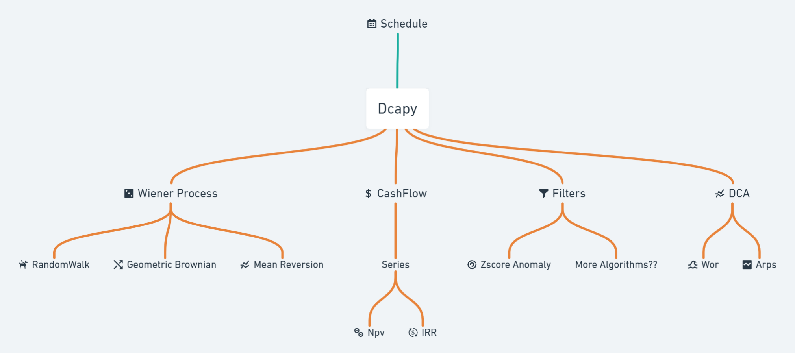

# Dcapy

+ **Documentation** [http://orkahub.github.io/dcapy](http://orkahub.github.io/dcapy)
+ **Sorce Code** [https://github.com/orkahub/dcapy](https://github.com/orkahub/dcapy)

Dcapy is a Decline Curve Analysis Python package for Oil & Gas that includes the classes and functions to perform a simple production forecast as well as probabilistic Well Schedules with cashflow analysis.  

The key features are:

+ **Simple**: Arps and Wor forecast methodologies implemented
+ **Schedule**: Create multiple forecast *periods* for a single well that represent major interventions, new perforations, etc 
+ **Scenarios**: Create multiple Scenarios and evalueate their performance easily
+ **Cash Flow**: Add cashflow parameters (Income, opex, capex) to perform a cashflow analysis to each Period and/or Scenario
+ **Deterministic/Probabilistic**: Add probabilistic variables to add a risk analysis to both simple forecast and schedules. Automatically reschedule start production depending on the callbacks.
+ **Data Validation**: Dcapy uses Pydantic to make data validations when creating new instances

## Schema



## Requirements

+ Python 3.8+ 


## Installation


```console
$ pip install dcapy

---> 100%
```


## License

This project is licensed under the terms of the MIT license.