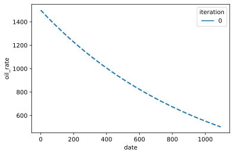
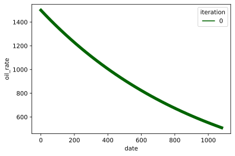
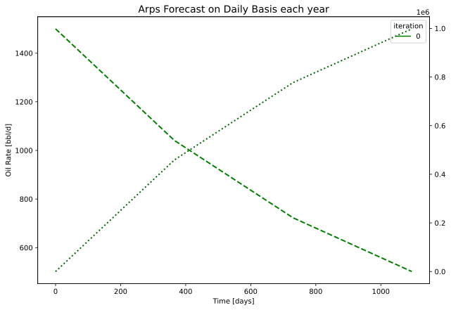
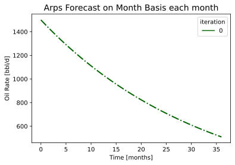
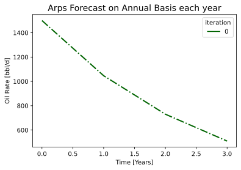
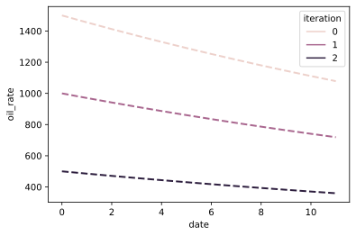
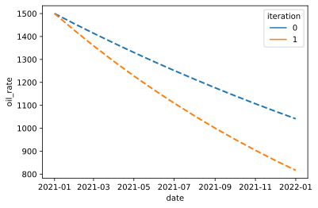

# Dcapy -  Arps Class

This section introduces the `Arps` class which is a *'wrapper'* for the Arps Function seen in the previous section. It add certain functionalities to the forecast estimation, like dates, plots, cumulatives, water calculation.  

By taking advantage of python Object-Oriented functionalities it is very convinient to define a class with the required properties to make an Arps declination analysis. With the class are defined methods that help to make the forecast in a very flexible way. That means you can make different kind of forecast from the same Arps declination parameters. 


```python
import os
from dcapy import dca
import numpy as np 
import pandas as pd
from datetime import date
import matplotlib.pyplot as plt
import seaborn as sns 
from scipy import stats

```
## Arps Class

As seen in the previous section to define an Arps declination object you must have a *Decline rate* `di`, *b coefficient* `b`, *Initial Time* `Ti`, *Initial rate* `qi`. With these properties you can create a simple Arps Class. The time array to make a forecast can vary depending on the horizon time, frequency or rates limits. In that way you can estimate multiple forecast from the same class depending on the needs. 

Let's define a simple Aprs class by providing the same properties we have been seen. 
We can add a property we had not seen so far which is useful when we incorporates different time units. The units of the declination rate `di`. So far we can handle three periods of time. Days, Months and years.


```python
# Define a Simple Arps Class

a1 = dca.Arps(
    ti = 0,
    di = 0.03,
    qi = 1500,
    b = 0,
    freq_di='M'
)

print(a1)

```

    Declination 
     Ti: 0 
     Qi: 1500.0 bbl/d 
     Di: 0.03 M 
     b: 0.0


We have defined a Arps class with a nominal declination rate of 0.03 monthly. This is usefull if you want to make a forecast on differnt time basis. You can get forecast on daily, monthly or annual basis from the same Arps Class

### Time basis 

When the time is defined with integers, they can represent any of the periods available (days, months or years). For example you can define forecast on daily basis each day or on daily basis each month. Next are the different ways you can create forecast

By calling the method `forecast` and providing either a time array or the start and end, and the frequencies of the output it returns a pandas DataFrame with the forecast with some useful metadata


```python
print('Calculate Daily Basis each day')

fr = a1.forecast(start=0,end=1095,freq_input='D',freq_output='D')
print(fr)
```

    Calculate Daily Basis each day
             oil_rate        oil_cum  iteration   oil_volume
    date                                                    
    0     1500.000000       0.000000          0  1499.250250
    1     1498.500750    1499.250250          0  1498.501000
    2     1497.002998    2997.001999          0  1497.003248
    3     1495.506743    4493.256745          0  1495.506993
    4     1494.011984    5988.015984          0  1494.012233
    ...           ...            ...        ...          ...
    1090   504.324741  995675.259440          0   504.324825
    1091   503.820668  996179.332102          0   503.820752
    1092   503.317099  996682.900944          0   503.317183
    1093   502.814034  997185.966468          0   502.814117
    1094   502.311471  997688.529178          0   502.562710
    
    [1095 rows x 4 columns]


Let's Plot it instead


```python
print('Calculate Daily Basis each day - Plot')

fr = a1.plot(start=0,end=1095,freq_input='D',freq_output='D')
```

    Calculate Daily Basis each day - Plot


    

    


Generate forecast with more periods alternatives


```python
print('Calculate Daily Basis each Month')

fr = a1.forecast(start=0,end=1096,freq_input='D',freq_output='M')
print(fr)

a1.plot(start=0,end=1096,freq_input='D',freq_output='M',rate_kw=dict(palette=['darkgreen'],linestyle='-',linewidth=5))
```

    Calculate Daily Basis each Month
             oil_rate        oil_cum  iteration    oil_volume
    date                                                     
    0     1500.000000       0.000000          0  44331.699677
    30    1455.668300   44331.699677          0  43676.599812
    60    1412.646800   87353.199624          0  42385.761208
    90    1370.896778  129103.222093          0  41133.072650
    120   1330.380655  169619.344924          0  39917.406635
    150   1291.061965  208938.035362          0  38737.668979
    180   1252.905317  247094.682883          0  37592.797841
    210   1215.876369  284123.631045          0  36481.762759
    240   1179.941792  320058.208400          0  35403.563725
    270   1145.069242  354930.758495          0  34357.230289
    300   1111.227331  388772.668977          0  33341.820679
    330   1078.385600  421614.399852          0  32356.420958
    360   1046.514489  453485.510893          0  31400.144200
    390   1015.585312  484414.688253          0  30472.129692
    420    985.570230  514429.770277          0  29571.542157
    450    956.442227  543557.772567          0  28697.571007
    480    928.175088  571824.912291          0  27849.429607
    510    900.743368  599256.631782          0  27026.354574
    540    874.122379  625877.621439          0  26227.605085
    570    848.288158  651711.841951          0  25452.462210
    600    823.217454  676782.545859          0  24700.228269
    630    798.887702  701112.298490          0  23970.226202
    660    775.277002  724722.998262          0  23261.798956
    690    752.364104  747635.896401          0  22574.308899
    720    730.128384  769871.616060          0  21907.137244
    750    708.549829  791450.170888          0  21259.683491
    780    687.609017  812390.983042          0  20631.364889
    810    667.287099  832712.900666          0  20021.615907
    840    647.565785  852434.214856          0  19429.887731
    870    628.427324  871572.676129          0  18855.647766
    900    609.854490  890145.510389          0  18298.379157
    930    591.830566  908169.434443          0  17757.580324
    960    574.339329  925660.671037          0  17232.764512
    990    557.365037  942634.963467          0  16723.459352
    1020   540.892410  959107.589740          0  16229.206433
    1050   524.906624  975093.376333          0  15749.560896
    1080   509.393288  990606.711533          0  15513.335199


    

    


```python
print('Calculate Daily Basis each Year')

fr = a1.forecast(start=0,end=1096,freq_input='D',freq_output='A')
print(fr)

#Assign to a matplotlib axes
fig, ax = plt.subplots(figsize=(10,7))

a1.plot(start=0,end=1096,freq_input='D',freq_output='A',cum=True,rate_kw = {'palette':['green']}, ax=ax)
ax.set_title('Arps Forecast on Daily Basis each year', fontsize=14)
ax.set_xlabel('Time [days]', fontsize=10)
ax.set_ylabel('Oil Rate [bbl/d]', fontsize=10)
```

    Calculate Daily Basis each Year
             oil_rate        oil_cum  iteration     oil_volume
    date                                                      
    0     1500.000000       0.000000          0  458705.023683
    365   1041.294976  458705.023683          0  388568.257432
    730    722.863485  777136.514865          0  269742.782947
    1095   501.809410  998190.589577          0  221054.074712


    Text(0, 0.5, 'Oil Rate [bbl/d]')


    

    


```python
print('Calculate Monthly Basis each Month')

fr = a1.forecast(start=0,end=37,freq_input='M',freq_output='M')
print(fr)

fig, ax = plt.subplots()
a1.plot(start=0,end=37,freq_input='M',freq_output='M',rate_kw=dict(palette=['darkgreen'],linestyle='-.',linewidth=2))
ax.set_title('Arps Forecast on Month Basis each month', fontsize=14)
ax.set_xlabel('Time [months]', fontsize=10)
ax.set_ylabel('Oil Rate [bbl/d]', fontsize=10)

```

    Calculate Monthly Basis each Month
             oil_rate        oil_cum  iteration    oil_volume
    date                                                     
    0     1500.000000       0.000000          0  44331.699677
    1     1455.668300   44331.699677          0  43676.599812
    2     1412.646800   87353.199624          0  42385.761208
    3     1370.896778  129103.222093          0  41133.072650
    4     1330.380655  169619.344924          0  39917.406635
    5     1291.061965  208938.035362          0  38737.668979
    6     1252.905317  247094.682883          0  37592.797841
    7     1215.876369  284123.631045          0  36481.762759
    8     1179.941792  320058.208400          0  35403.563725
    9     1145.069242  354930.758495          0  34357.230289
    10    1111.227331  388772.668977          0  33341.820679
    11    1078.385600  421614.399852          0  32356.420958
    12    1046.514489  453485.510893          0  31400.144200
    13    1015.585312  484414.688253          0  30472.129692
    14     985.570230  514429.770277          0  29571.542157
    15     956.442227  543557.772567          0  28697.571007
    16     928.175088  571824.912291          0  27849.429607
    17     900.743368  599256.631782          0  27026.354574
    18     874.122379  625877.621439          0  26227.605085
    19     848.288158  651711.841951          0  25452.462210
    20     823.217454  676782.545859          0  24700.228269
    21     798.887702  701112.298490          0  23970.226202
    22     775.277002  724722.998262          0  23261.798956
    23     752.364104  747635.896401          0  22574.308899
    24     730.128384  769871.616060          0  21907.137244
    25     708.549829  791450.170888          0  21259.683491
    26     687.609017  812390.983042          0  20631.364889
    27     667.287099  832712.900666          0  20021.615907
    28     647.565785  852434.214856          0  19429.887731
    29     628.427324  871572.676129          0  18855.647766
    30     609.854490  890145.510389          0  18298.379157
    31     591.830566  908169.434443          0  17757.580324
    32     574.339329  925660.671037          0  17232.764512
    33     557.365037  942634.963467          0  16723.459352
    34     540.892410  959107.589740          0  16229.206433
    35     524.906624  975093.376333          0  15749.560896
    36     509.393288  990606.711533          0  15513.335199


    Text(0, 0.5, 'Oil Rate [bbl/d]')


    

    


```python
print('Calculate Monthly Basis each Year')

fr = a1.forecast(start=0,end=37,freq_input='M',freq_output='A')
print(fr)

fig, ax = plt.subplots()
a1.plot(start=0,end=37,freq_input='M',freq_output='A',rate_kw=dict(palette=['darkgreen'],linestyle='-.',linewidth=2))
ax.set_title('Arps Forecast on Month Basis each year', fontsize=14)
ax.set_xlabel('Time [months]', fontsize=10)
ax.set_ylabel('Oil Rate [bbl/d]', fontsize=10)
```

    Calculate Monthly Basis each Year
             oil_rate        oil_cum  iteration     oil_volume
    date                                                      
    0     1500.000000       0.000000          0  453485.510893
    12    1046.514489  453485.510893          0  384935.808030
    24     730.128384  769871.616060          0  268560.600320
    36     509.393288  990606.711533          0  220735.095473


    Text(0, 0.5, 'Oil Rate [bbl/d]')


    

    


```python
print('Calculate Annual Basis each Year')

fr = a1.forecast(start=0,end=4,freq_input='A',freq_output='A')
print(fr)

fig, ax = plt.subplots()
a1.plot(start=0,end=4,freq_input='A',freq_output='A',rate_kw=dict(palette=['darkgreen'],linestyle='-.',linewidth=2))
ax.set_title('Arps Forecast on Annual Basis each year', fontsize=14)
ax.set_xlabel('Time [Years]', fontsize=10)
ax.set_ylabel('Oil Rate [bbl/d]', fontsize=10)
```

    Calculate Annual Basis each Year
             oil_rate       oil_cum  iteration     oil_volume
    date                                                     
    0     1500.000000  0.000000e+00          0  459783.920767
    1     1046.514489  4.597839e+05          0  390282.138697
    2      730.128384  7.805643e+05          0  272290.608657
    3      509.393288  1.004365e+06          0  223800.860687


    Text(0, 0.5, 'Oil Rate [bbl/d]')


    

    


## Multiple Values 

You may have noticed that the pandas dataframe returned with the forecast has a column name *iteration*. As we have defined so far a singles parameters for the Arps class it is created only one iteration. 

You can declare Multiple values for any of the Arps parameters and they will result on Multiple iteration on the pandas dataframe.


```python
# Define an Arps Class with multiple values

a2 = dca.Arps(
    ti = 0,
    di = 0.03,
    qi = [1500,1000,500],
    b = 0,
    freq_di='M'
)

print(a2)
```

    Declination 
     Ti: 0 
     Qi: [1500.0, 1000.0, 500.0] bbl/d 
     Di: 0.03 M 
     b: 0.0


```python
print('Calculate Monthly Basis each month - Multiple parameters')

fr = a2.forecast(start=0,end=12,freq_input='M',freq_output='M')
print(fr)

fig, ax = plt.subplots()
a2.plot(start=0,end=12,freq_input='M',freq_output='M')

```

    Calculate Monthly Basis each month - Multiple parameters
             oil_rate        oil_cum  iteration    oil_volume
    date                                                     
    0     1500.000000       0.000000          0  44331.699677
    1     1455.668300   44331.699677          0  43676.599812
    2     1412.646800   87353.199624          0  42385.761208
    3     1370.896778  129103.222093          0  41133.072650
    4     1330.380655  169619.344924          0  39917.406635
    5     1291.061965  208938.035362          0  38737.668979
    6     1252.905317  247094.682883          0  37592.797841
    7     1215.876369  284123.631045          0  36481.762759
    8     1179.941792  320058.208400          0  35403.563725
    9     1145.069242  354930.758495          0  34357.230289
    10    1111.227331  388772.668977          0  33341.820679
    11    1078.385600  421614.399852          0  32841.730875
    0     1000.000000       0.000000          1  29554.466451
    1      970.445534   29554.466451          1  29117.733208
    2      941.764534   58235.466416          1  28257.174139
    3      913.931185   86068.814729          1  27422.048434
    4      886.920437  113079.563283          1  26611.604423
    5      860.707976  139292.023575          1  25825.112653
    6      835.270211  164729.788589          1  25061.865227
    7      810.584246  189415.754030          1  24321.175172
    8      786.627861  213372.138933          1  23602.375817
    9      763.379494  236620.505663          1  22904.820192
    10     740.818221  259181.779318          1  22227.880452
    11     718.923733  281076.266568          1  21894.487250
    0      500.000000       0.000000          2  14777.233226
    1      485.222767   14777.233226          2  14558.866604
    2      470.882267   29117.733208          2  14128.587069
    3      456.965593   43034.407364          2  13711.024217
    4      443.460218   56539.781641          2  13305.802212
    5      430.353988   69646.011787          2  12912.556326
    6      417.635106   82364.894294          2  12530.932614
    7      405.292123   94707.877015          2  12160.587586
    8      393.313931  106686.069467          2  11801.187908
    9      381.689747  118310.252832          2  11452.410096
    10     370.409110  129590.889659          2  11113.940226
    11     359.461867  140538.133284          2  10947.243625


    

    


### Estimate Water Rate.

You can add water columns for the returning forecast by providing either a fluid rate or water cut. When any of them is provided the function assumes they are constant and the water estimation are simple substraction.


```python
# Define an Arps Class with multiple values - Fluid rate

a3 = dca.Arps(
    ti = 0,
    di = 0.03,
    qi = [1500,1450],
    b = [0,1],
    freq_di='M', 
    fluid_rate = 2000
)

fr = a3.forecast(start=0,end=12,freq_input='M',freq_output='M')
print(fr)
```

             oil_rate        oil_cum  iteration    oil_volume  fluid_rate  \
    date                                                                    
    0     1500.000000       0.000000          0  44331.699677      2000.0   
    1     1455.668300   44331.699677          0  43676.599812      2000.0   
    2     1412.646800   87353.199624          0  42385.761208      2000.0   
    3     1370.896778  129103.222093          0  41133.072650      2000.0   
    4     1330.380655  169619.344924          0  39917.406635      2000.0   
    5     1291.061965  208938.035362          0  38737.668979      2000.0   
    6     1252.905317  247094.682883          0  37592.797841      2000.0   
    7     1215.876369  284123.631045          0  36481.762759      2000.0   
    8     1179.941792  320058.208400          0  35403.563725      2000.0   
    9     1145.069242  354930.758495          0  34357.230289      2000.0   
    10    1111.227331  388772.668977          0  33341.820679      2000.0   
    11    1078.385600  421614.399852          0  32841.730875      2000.0   
    0     1450.000000       0.000000          1  42860.263250      2000.0   
    1     1407.766990   42860.263250          1  42244.958390      2000.0   
    2     1367.924528   84489.916780          1  41048.698150      2000.0   
    3     1330.275229  124957.659550          1  39918.338458      2000.0   
    4     1294.642857  164326.593695          1  38848.578447      2000.0   
    5     1260.869565  202654.816444          1  37834.671049      2000.0   
    6     1228.813559  239995.935792          1  36872.352494      2000.0   
    7     1198.347107  276399.521433          1  35957.782326      2000.0   
    8     1169.354839  311911.500445          1  35087.492125      2000.0   
    9     1141.732283  346574.505682          1  34258.341517      2000.0   
    10    1115.384615  380428.183478          1  33467.480278      2000.0   
    11    1090.225564  413509.466239          1  33081.282761      2000.0   
    
          water_rate       bsw       wor      water_cum  fluid_cum  water_volume  \
    date                                                                           
    0     500.000000  0.250000  0.333333       0.000000        0.0  16329.950990   
    1     544.331700  0.272166  0.373939   16329.950990    60000.0  16975.273490   
    2     587.353200  0.293677  0.415782   33950.546979   120000.0  18246.846326   
    3     629.103222  0.314552  0.458899   52823.643642   180000.0  19480.838505   
    4     669.619345  0.334810  0.503329   72912.223990   240000.0  20678.360704   
    5     708.938035  0.354469  0.549112   94180.365050   300000.0  21840.490774   
    6     747.094683  0.373547  0.596290  116593.205537   360000.0  22968.274709   
    7     784.123631  0.392062  0.644904  140116.914468   420000.0  24062.727592   
    8     820.058208  0.410029  0.694999  164718.660720   480000.0  25124.834503   
    9     854.930758  0.427465  0.746619  190366.583475   540000.0  26155.551412   
    10    888.772669  0.444386  0.799812  217029.763544   600000.0  27155.806032   
    11    921.614400  0.460807  0.854624  244678.195540   660000.0  27648.431996   
    0     550.000000  0.275000  0.379310       0.000000        0.0  17766.990291   
    1     592.233010  0.296117  0.420690   17766.990291    60000.0  18364.627221   
    2     632.075472  0.316038  0.462069   36729.254442   120000.0  19527.003635   
    3     669.724771  0.334862  0.503448   56820.997561   180000.0  20626.228702   
    4     705.357143  0.352679  0.544828   77981.711847   240000.0  21667.313665   
    5     739.130435  0.369565  0.586207  100155.624891   300000.0  22654.753132   
    6     771.186441  0.385593  0.627586  123291.218111   360000.0  23592.589999   
    7     801.652893  0.400826  0.668966  147340.804888   420000.0  24484.470808   
    8     830.645161  0.415323  0.710345  172260.159727   480000.0  25333.693167   
    9     858.267717  0.429134  0.751724  198008.191223   540000.0  26143.246517   
    10    884.615385  0.442308  0.793103  224546.652761   600000.0  26915.847311   
    11    909.774436  0.454887  0.834483  251839.885844   660000.0  27293.233083   
    
          fluid_volume  
    date                
    0          60000.0  
    1          60000.0  
    2          60000.0  
    3          60000.0  
    4          60000.0  
    5          60000.0  
    6          60000.0  
    7          60000.0  
    8          60000.0  
    9          60000.0  
    10         60000.0  
    11         60000.0  
    0          60000.0  
    1          60000.0  
    2          60000.0  
    3          60000.0  
    4          60000.0  
    5          60000.0  
    6          60000.0  
    7          60000.0  
    8          60000.0  
    9          60000.0  
    10         60000.0  
    11         60000.0  
    /home/scuervo91/dev/apps/dcapy/dcapy/dca/arps.py:82: RuntimeWarning: invalid value encountered in multiply
      return f*(g-h)


```python
a4 = dca.Arps(
    ti = 0,
    di = 0.03,
    qi = [1500,1450],
    b = [0,1],
    freq_di='M', 
    bsw = 0.6
)

fr = a4.forecast(start=0,end=12,freq_input='M',freq_output='M')
print(fr)
```

             oil_rate        oil_cum  iteration    oil_volume  bsw   water_rate  \
    date                                                                          
    0     1500.000000       0.000000          0  44331.699677  0.6  2250.000000   
    1     1455.668300   44331.699677          0  43676.599812  0.6  2183.502450   
    2     1412.646800   87353.199624          0  42385.761208  0.6  2118.970201   
    3     1370.896778  129103.222093          0  41133.072650  0.6  2056.345167   
    4     1330.380655  169619.344924          0  39917.406635  0.6  1995.570983   
    5     1291.061965  208938.035362          0  38737.668979  0.6  1936.592947   
    6     1252.905317  247094.682883          0  37592.797841  0.6  1879.357976   
    7     1215.876369  284123.631045          0  36481.762759  0.6  1823.814553   
    8     1179.941792  320058.208400          0  35403.563725  0.6  1769.912687   
    9     1145.069242  354930.758495          0  34357.230289  0.6  1717.603862   
    10    1111.227331  388772.668977          0  33341.820679  0.6  1666.840997   
    11    1078.385600  421614.399852          0  32841.730875  0.6  1617.578400   
    0     1450.000000       0.000000          1  42860.263250  0.6  2175.000000   
    1     1407.766990   42860.263250          1  42244.958390  0.6  2111.650485   
    2     1367.924528   84489.916780          1  41048.698150  0.6  2051.886792   
    3     1330.275229  124957.659550          1  39918.338458  0.6  1995.412844   
    4     1294.642857  164326.593695          1  38848.578447  0.6  1941.964286   
    5     1260.869565  202654.816444          1  37834.671049  0.6  1891.304348   
    6     1228.813559  239995.935792          1  36872.352494  0.6  1843.220339   
    7     1198.347107  276399.521433          1  35957.782326  0.6  1797.520661   
    8     1169.354839  311911.500445          1  35087.492125  0.6  1754.032258   
    9     1141.732283  346574.505682          1  34258.341517  0.6  1712.598425   
    10    1115.384615  380428.183478          1  33467.480278  0.6  1673.076923   
    11    1090.225564  413509.466239          1  33081.282761  0.6  1635.338346   
    
           fluid_rate  wor      water_cum     fluid_cum  water_volume  \
    date                                                                
    0     3750.000000  1.5       0.000000  0.000000e+00  65505.073515   
    1     3639.170751  1.5   65505.073515  1.091751e+05  64537.089766   
    2     3531.617001  1.5  129074.179531  2.151236e+05  62629.730511   
    3     3427.241945  1.5  190764.534537  3.179409e+05  60778.742242   
    4     3325.951638  1.5  250631.664016  4.177194e+05  58982.458944   
    5     3227.654912  1.5  308729.452424  5.145491e+05  57239.263839   
    6     3132.263293  1.5  365110.191695  6.085170e+05  55547.587937   
    7     3039.690922  1.5  419824.628298  6.997077e+05  53905.908612   
    8     2949.854479  1.5  472922.008920  7.882033e+05  52312.748245   
    9     2862.673104  1.5  524450.124787  8.740835e+05  50766.672882   
    10    2778.068328  1.5  574455.354683  9.574256e+05  49266.290951   
    11    2695.964000  1.5  622982.706690  1.038305e+06  48527.352007   
    0     3625.000000  1.5       0.000000  0.000000e+00  63349.514563   
    1     3519.417476  1.5   63349.514563  1.055825e+05  62453.059168   
    2     3419.811321  1.5  124906.118337  2.081769e+05  60709.494547   
    3     3325.688073  1.5  184768.503658  3.079475e+05  59060.656946   
    4     3236.607143  1.5  243027.432229  4.050457e+05  57499.029503   
    5     3152.173913  1.5  299766.562664  4.996109e+05  56017.870302   
    6     3072.033898  1.5  355063.172833  5.917720e+05  54611.115002   
    7     2995.867769  1.5  408988.792668  6.816480e+05  53273.293788   
    8     2923.387097  1.5  461609.760410  7.693496e+05  51999.460249   
    9     2854.330709  1.5  512987.713166  8.549795e+05  50785.130224   
    10    2788.461538  1.5  563180.020858  9.386334e+05  49626.229034   
    11    2725.563910  1.5  612240.171234  1.020400e+06  49060.150376   
    
           fluid_volume  
    date                 
    0     109175.122524  
    1     107561.816276  
    2     104382.884186  
    3     101297.903737  
    4      98304.098239  
    5      95398.773066  
    6      92579.313228  
    7      89843.181021  
    8      87187.913741  
    9      84611.121470  
    10     82110.484919  
    11     80878.920011  
    0     105582.524272  
    1     104088.431947  
    2     101182.490912  
    3      98434.428244  
    4      95831.715839  
    5      93363.117170  
    6      91018.525004  
    7      88788.822981  
    8      86665.767082  
    9      84641.883707  
    10     82710.381724  
    11     81766.917293  
    /home/scuervo91/dev/apps/dcapy/dcapy/dca/arps.py:82: RuntimeWarning: invalid value encountered in multiply
      return f*(g-h)


Remember you can pass a time list with a custom time distribution


```python
fr = a4.forecast(time_list=[0,2,3,4,6,8,12],freq_input='M',freq_output='M')
fr
```

    /home/scuervo91/dev/apps/dcapy/dcapy/dca/arps.py:82: RuntimeWarning: invalid value encountered in multiply
      return f*(g-h)


<div>
<style scoped>
    .dataframe tbody tr th:only-of-type {
        vertical-align: middle;
    }

    .dataframe tbody tr th {
        vertical-align: top;
    }

    .dataframe thead th {
        text-align: right;
    }
</style>
<table border="1" class="dataframe">
  <thead>
    <tr style="text-align: right;">
      <th></th>
      <th>oil_rate</th>
      <th>oil_cum</th>
      <th>iteration</th>
      <th>oil_volume</th>
      <th>bsw</th>
      <th>water_rate</th>
      <th>fluid_rate</th>
      <th>wor</th>
      <th>water_cum</th>
      <th>fluid_cum</th>
      <th>water_volume</th>
      <th>fluid_volume</th>
    </tr>
    <tr>
      <th>date</th>
      <th></th>
      <th></th>
      <th></th>
      <th></th>
      <th></th>
      <th></th>
      <th></th>
      <th></th>
      <th></th>
      <th></th>
      <th></th>
      <th></th>
    </tr>
  </thead>
  <tbody>
    <tr>
      <th>0</th>
      <td>1500.000000</td>
      <td>0.000000</td>
      <td>0</td>
      <td>87353.199624</td>
      <td>0.6</td>
      <td>2250.000000</td>
      <td>3750.000000</td>
      <td>1.5</td>
      <td>0.000000</td>
      <td>0.000000e+00</td>
      <td>127138.212034</td>
      <td>211897.020056</td>
    </tr>
    <tr>
      <th>2</th>
      <td>1412.646800</td>
      <td>87353.199624</td>
      <td>0</td>
      <td>64551.611047</td>
      <td>0.6</td>
      <td>2118.970201</td>
      <td>3531.617001</td>
      <td>1.5</td>
      <td>127138.212034</td>
      <td>2.118970e+05</td>
      <td>94414.283520</td>
      <td>157357.139200</td>
    </tr>
    <tr>
      <th>3</th>
      <td>1370.896778</td>
      <td>129103.222093</td>
      <td>0</td>
      <td>41133.072650</td>
      <td>0.6</td>
      <td>2056.345167</td>
      <td>3427.241945</td>
      <td>1.5</td>
      <td>188828.567040</td>
      <td>3.147143e+05</td>
      <td>60778.742242</td>
      <td>101297.903737</td>
    </tr>
    <tr>
      <th>4</th>
      <td>1330.380655</td>
      <td>169619.344924</td>
      <td>0</td>
      <td>58995.730395</td>
      <td>0.6</td>
      <td>1995.570983</td>
      <td>3325.951638</td>
      <td>1.5</td>
      <td>248695.696518</td>
      <td>4.144928e+05</td>
      <td>86314.304009</td>
      <td>143857.173349</td>
    </tr>
    <tr>
      <th>6</th>
      <td>1252.905317</td>
      <td>247094.682883</td>
      <td>0</td>
      <td>75219.431738</td>
      <td>0.6</td>
      <td>1879.357976</td>
      <td>3132.263293</td>
      <td>1.5</td>
      <td>361457.175059</td>
      <td>6.024286e+05</td>
      <td>109478.119892</td>
      <td>182463.533154</td>
    </tr>
    <tr>
      <th>8</th>
      <td>1179.941792</td>
      <td>320058.208400</td>
      <td>0</td>
      <td>103195.414005</td>
      <td>0.6</td>
      <td>1769.912687</td>
      <td>2949.854479</td>
      <td>1.5</td>
      <td>467651.936303</td>
      <td>7.794199e+05</td>
      <td>147283.684642</td>
      <td>245472.807736</td>
    </tr>
    <tr>
      <th>12</th>
      <td>1046.514489</td>
      <td>453485.510893</td>
      <td>0</td>
      <td>133427.302493</td>
      <td>0.6</td>
      <td>1569.771734</td>
      <td>2616.286223</td>
      <td>1.5</td>
      <td>656024.544342</td>
      <td>1.093374e+06</td>
      <td>188372.608039</td>
      <td>313954.346732</td>
    </tr>
    <tr>
      <th>0</th>
      <td>1450.000000</td>
      <td>0.000000</td>
      <td>1</td>
      <td>84489.916780</td>
      <td>0.6</td>
      <td>2175.000000</td>
      <td>3625.000000</td>
      <td>1.5</td>
      <td>0.000000</td>
      <td>0.000000e+00</td>
      <td>123113.207547</td>
      <td>205188.679245</td>
    </tr>
    <tr>
      <th>2</th>
      <td>1367.924528</td>
      <td>84489.916780</td>
      <td>1</td>
      <td>62478.829775</td>
      <td>0.6</td>
      <td>2051.886792</td>
      <td>3419.811321</td>
      <td>1.5</td>
      <td>123113.207547</td>
      <td>2.051887e+05</td>
      <td>91487.796434</td>
      <td>152479.660724</td>
    </tr>
    <tr>
      <th>3</th>
      <td>1330.275229</td>
      <td>124957.659550</td>
      <td>1</td>
      <td>39918.338458</td>
      <td>0.6</td>
      <td>1995.412844</td>
      <td>3325.688073</td>
      <td>1.5</td>
      <td>182975.592868</td>
      <td>3.049593e+05</td>
      <td>59060.656946</td>
      <td>98434.428244</td>
    </tr>
    <tr>
      <th>4</th>
      <td>1294.642857</td>
      <td>164326.593695</td>
      <td>1</td>
      <td>57519.138121</td>
      <td>0.6</td>
      <td>1941.964286</td>
      <td>3236.607143</td>
      <td>1.5</td>
      <td>241234.521440</td>
      <td>4.020575e+05</td>
      <td>84426.074455</td>
      <td>140710.124092</td>
    </tr>
    <tr>
      <th>6</th>
      <td>1228.813559</td>
      <td>239995.935792</td>
      <td>1</td>
      <td>73792.453375</td>
      <td>0.6</td>
      <td>1843.220339</td>
      <td>3072.033898</td>
      <td>1.5</td>
      <td>351827.741779</td>
      <td>5.863796e+05</td>
      <td>107917.577911</td>
      <td>179862.629852</td>
    </tr>
    <tr>
      <th>8</th>
      <td>1169.354839</td>
      <td>311911.500445</td>
      <td>1</td>
      <td>102928.439421</td>
      <td>0.6</td>
      <td>1754.032258</td>
      <td>2923.387097</td>
      <td>1.5</td>
      <td>457069.677263</td>
      <td>7.617828e+05</td>
      <td>148576.850095</td>
      <td>247628.083491</td>
    </tr>
    <tr>
      <th>12</th>
      <td>1066.176471</td>
      <td>445852.814635</td>
      <td>1</td>
      <td>133941.314190</td>
      <td>0.6</td>
      <td>1599.264706</td>
      <td>2665.441176</td>
      <td>1.5</td>
      <td>648981.441968</td>
      <td>1.081636e+06</td>
      <td>191911.764706</td>
      <td>319852.941176</td>
    </tr>
  </tbody>
</table>
</div>


### Using Arps class with dates

You can also define the Arps class with dates. Like before, the output frequency approach also works


```python
a5 = dca.Arps(
    ti = date(2021,1,1),
    di = [0.03,0.05],
    qi = 1500,
    b = 0,
    freq_di='M', 
    fluid_rate = 2000
)
print(a5)
```

    Declination 
     Ti: 2021-01-01 
     Qi: 1500.0 bbl/d 
     Di: [0.03, 0.05] M 
     b: 0.0


```python
fr = a5.forecast(start=date(2021,1,1),end=date(2021,1,10),freq_output='D')
fr
```


<div>
<style scoped>
    .dataframe tbody tr th:only-of-type {
        vertical-align: middle;
    }

    .dataframe tbody tr th {
        vertical-align: top;
    }

    .dataframe thead th {
        text-align: right;
    }
</style>
<table border="1" class="dataframe">
  <thead>
    <tr style="text-align: right;">
      <th></th>
      <th>oil_rate</th>
      <th>oil_cum</th>
      <th>iteration</th>
      <th>oil_volume</th>
      <th>fluid_rate</th>
      <th>water_rate</th>
      <th>bsw</th>
      <th>wor</th>
      <th>water_cum</th>
      <th>fluid_cum</th>
      <th>water_volume</th>
      <th>fluid_volume</th>
    </tr>
    <tr>
      <th>date</th>
      <th></th>
      <th></th>
      <th></th>
      <th></th>
      <th></th>
      <th></th>
      <th></th>
      <th></th>
      <th></th>
      <th></th>
      <th></th>
      <th></th>
    </tr>
  </thead>
  <tbody>
    <tr>
      <th>2021-01-01</th>
      <td>1500.000000</td>
      <td>0.000000</td>
      <td>0</td>
      <td>1499.250250</td>
      <td>2000.0</td>
      <td>500.000000</td>
      <td>0.250000</td>
      <td>0.333333</td>
      <td>0.000000</td>
      <td>0.0</td>
      <td>501.499250</td>
      <td>2000.0</td>
    </tr>
    <tr>
      <th>2021-01-02</th>
      <td>1498.500750</td>
      <td>1499.250250</td>
      <td>0</td>
      <td>1498.501000</td>
      <td>2000.0</td>
      <td>501.499250</td>
      <td>0.250750</td>
      <td>0.334667</td>
      <td>501.499250</td>
      <td>2000.0</td>
      <td>502.248126</td>
      <td>2000.0</td>
    </tr>
    <tr>
      <th>2021-01-03</th>
      <td>1497.002998</td>
      <td>2997.001999</td>
      <td>0</td>
      <td>1497.003248</td>
      <td>2000.0</td>
      <td>502.997002</td>
      <td>0.251499</td>
      <td>0.336003</td>
      <td>1004.496252</td>
      <td>4000.0</td>
      <td>503.745129</td>
      <td>2000.0</td>
    </tr>
    <tr>
      <th>2021-01-04</th>
      <td>1495.506743</td>
      <td>4493.256745</td>
      <td>0</td>
      <td>1495.506993</td>
      <td>2000.0</td>
      <td>504.493257</td>
      <td>0.252247</td>
      <td>0.337339</td>
      <td>1508.989509</td>
      <td>6000.0</td>
      <td>505.240636</td>
      <td>2000.0</td>
    </tr>
    <tr>
      <th>2021-01-05</th>
      <td>1494.011984</td>
      <td>5988.015984</td>
      <td>0</td>
      <td>1494.012233</td>
      <td>2000.0</td>
      <td>505.988016</td>
      <td>0.252994</td>
      <td>0.338677</td>
      <td>2014.977525</td>
      <td>8000.0</td>
      <td>506.734649</td>
      <td>2000.0</td>
    </tr>
    <tr>
      <th>2021-01-06</th>
      <td>1492.518719</td>
      <td>7481.281211</td>
      <td>0</td>
      <td>1492.518968</td>
      <td>2000.0</td>
      <td>507.481281</td>
      <td>0.253741</td>
      <td>0.340017</td>
      <td>2522.458806</td>
      <td>10000.0</td>
      <td>508.227168</td>
      <td>2000.0</td>
    </tr>
    <tr>
      <th>2021-01-07</th>
      <td>1491.026946</td>
      <td>8973.053919</td>
      <td>0</td>
      <td>1491.027195</td>
      <td>2000.0</td>
      <td>508.973054</td>
      <td>0.254487</td>
      <td>0.341357</td>
      <td>3031.431860</td>
      <td>12000.0</td>
      <td>509.718195</td>
      <td>2000.0</td>
    </tr>
    <tr>
      <th>2021-01-08</th>
      <td>1489.536664</td>
      <td>10463.335600</td>
      <td>0</td>
      <td>1489.536913</td>
      <td>2000.0</td>
      <td>510.463336</td>
      <td>0.255232</td>
      <td>0.342699</td>
      <td>3541.895196</td>
      <td>14000.0</td>
      <td>511.207732</td>
      <td>2000.0</td>
    </tr>
    <tr>
      <th>2021-01-09</th>
      <td>1488.047872</td>
      <td>11952.127744</td>
      <td>0</td>
      <td>1488.048120</td>
      <td>2000.0</td>
      <td>511.952128</td>
      <td>0.255976</td>
      <td>0.344043</td>
      <td>4053.847323</td>
      <td>16000.0</td>
      <td>512.695780</td>
      <td>2000.0</td>
    </tr>
    <tr>
      <th>2021-01-10</th>
      <td>1486.560568</td>
      <td>13439.431841</td>
      <td>0</td>
      <td>1487.304096</td>
      <td>2000.0</td>
      <td>513.439432</td>
      <td>0.256720</td>
      <td>0.345387</td>
      <td>4567.286755</td>
      <td>18000.0</td>
      <td>513.439432</td>
      <td>2000.0</td>
    </tr>
    <tr>
      <th>2021-01-01</th>
      <td>1500.000000</td>
      <td>0.000000</td>
      <td>1</td>
      <td>1498.750694</td>
      <td>2000.0</td>
      <td>500.000000</td>
      <td>0.250000</td>
      <td>0.333333</td>
      <td>0.000000</td>
      <td>0.0</td>
      <td>502.497918</td>
      <td>2000.0</td>
    </tr>
    <tr>
      <th>2021-01-02</th>
      <td>1497.502082</td>
      <td>1498.750694</td>
      <td>1</td>
      <td>1497.502775</td>
      <td>2000.0</td>
      <td>502.497918</td>
      <td>0.251249</td>
      <td>0.335557</td>
      <td>502.497918</td>
      <td>2000.0</td>
      <td>503.744797</td>
      <td>2000.0</td>
    </tr>
    <tr>
      <th>2021-01-03</th>
      <td>1495.008324</td>
      <td>2995.005551</td>
      <td>1</td>
      <td>1495.009016</td>
      <td>2000.0</td>
      <td>504.991676</td>
      <td>0.252496</td>
      <td>0.337785</td>
      <td>1007.489594</td>
      <td>4000.0</td>
      <td>506.236479</td>
      <td>2000.0</td>
    </tr>
    <tr>
      <th>2021-01-04</th>
      <td>1492.518719</td>
      <td>4488.768727</td>
      <td>1</td>
      <td>1492.519410</td>
      <td>2000.0</td>
      <td>507.481281</td>
      <td>0.253741</td>
      <td>0.340017</td>
      <td>1514.970875</td>
      <td>6000.0</td>
      <td>508.724011</td>
      <td>2000.0</td>
    </tr>
    <tr>
      <th>2021-01-05</th>
      <td>1490.033259</td>
      <td>5980.044370</td>
      <td>1</td>
      <td>1490.033949</td>
      <td>2000.0</td>
      <td>509.966741</td>
      <td>0.254983</td>
      <td>0.342252</td>
      <td>2024.937616</td>
      <td>8000.0</td>
      <td>511.207401</td>
      <td>2000.0</td>
    </tr>
    <tr>
      <th>2021-01-06</th>
      <td>1487.551939</td>
      <td>7468.836625</td>
      <td>1</td>
      <td>1487.552628</td>
      <td>2000.0</td>
      <td>512.448061</td>
      <td>0.256224</td>
      <td>0.344491</td>
      <td>2537.385677</td>
      <td>10000.0</td>
      <td>513.686655</td>
      <td>2000.0</td>
    </tr>
    <tr>
      <th>2021-01-07</th>
      <td>1485.074751</td>
      <td>8955.149626</td>
      <td>1</td>
      <td>1485.075438</td>
      <td>2000.0</td>
      <td>514.925249</td>
      <td>0.257463</td>
      <td>0.346734</td>
      <td>3052.310926</td>
      <td>12000.0</td>
      <td>516.161781</td>
      <td>2000.0</td>
    </tr>
    <tr>
      <th>2021-01-08</th>
      <td>1482.601687</td>
      <td>10438.987501</td>
      <td>1</td>
      <td>1482.602374</td>
      <td>2000.0</td>
      <td>517.398313</td>
      <td>0.258699</td>
      <td>0.348980</td>
      <td>3569.709238</td>
      <td>14000.0</td>
      <td>518.632785</td>
      <td>2000.0</td>
    </tr>
    <tr>
      <th>2021-01-09</th>
      <td>1480.132743</td>
      <td>11920.354374</td>
      <td>1</td>
      <td>1480.133428</td>
      <td>2000.0</td>
      <td>519.867257</td>
      <td>0.259934</td>
      <td>0.351230</td>
      <td>4089.576496</td>
      <td>16000.0</td>
      <td>521.099674</td>
      <td>2000.0</td>
    </tr>
    <tr>
      <th>2021-01-10</th>
      <td>1477.667909</td>
      <td>13399.254357</td>
      <td>1</td>
      <td>1478.899984</td>
      <td>2000.0</td>
      <td>522.332091</td>
      <td>0.261166</td>
      <td>0.353484</td>
      <td>4611.908586</td>
      <td>18000.0</td>
      <td>522.332091</td>
      <td>2000.0</td>
    </tr>
  </tbody>
</table>
</div>


```python
fr = a5.forecast(start=date(2021,1,1),end=date(2022,1,1),freq_output='M')
fr
```


<div>
<style scoped>
    .dataframe tbody tr th:only-of-type {
        vertical-align: middle;
    }

    .dataframe tbody tr th {
        vertical-align: top;
    }

    .dataframe thead th {
        text-align: right;
    }
</style>
<table border="1" class="dataframe">
  <thead>
    <tr style="text-align: right;">
      <th></th>
      <th>oil_rate</th>
      <th>oil_cum</th>
      <th>iteration</th>
      <th>oil_volume</th>
      <th>fluid_rate</th>
      <th>water_rate</th>
      <th>bsw</th>
      <th>wor</th>
      <th>water_cum</th>
      <th>fluid_cum</th>
      <th>water_volume</th>
      <th>fluid_volume</th>
    </tr>
    <tr>
      <th>date</th>
      <th></th>
      <th></th>
      <th></th>
      <th></th>
      <th></th>
      <th></th>
      <th></th>
      <th></th>
      <th></th>
      <th></th>
      <th></th>
      <th></th>
    </tr>
  </thead>
  <tbody>
    <tr>
      <th>2021-01</th>
      <td>1500.000000</td>
      <td>0.000000</td>
      <td>0</td>
      <td>45786.640386</td>
      <td>2000.0</td>
      <td>500.000000</td>
      <td>0.250000</td>
      <td>0.333333</td>
      <td>0.000000</td>
      <td>0.0</td>
      <td>16919.385852</td>
      <td>62000.0</td>
    </tr>
    <tr>
      <th>2021-02</th>
      <td>1454.213360</td>
      <td>45786.640386</td>
      <td>0</td>
      <td>42969.923132</td>
      <td>2000.0</td>
      <td>545.786640</td>
      <td>0.272893</td>
      <td>0.375314</td>
      <td>16919.385852</td>
      <td>62000.0</td>
      <td>16662.850774</td>
      <td>59000.0</td>
    </tr>
    <tr>
      <th>2021-03</th>
      <td>1414.060154</td>
      <td>85939.846264</td>
      <td>0</td>
      <td>41658.290854</td>
      <td>2000.0</td>
      <td>585.939846</td>
      <td>0.292970</td>
      <td>0.414367</td>
      <td>33325.701547</td>
      <td>118000.0</td>
      <td>17954.257790</td>
      <td>59000.0</td>
    </tr>
    <tr>
      <th>2021-04</th>
      <td>1370.896778</td>
      <td>129103.222093</td>
      <td>0</td>
      <td>41839.749330</td>
      <td>2000.0</td>
      <td>629.103222</td>
      <td>0.314552</td>
      <td>0.458899</td>
      <td>52827.901432</td>
      <td>180000.0</td>
      <td>19795.390116</td>
      <td>61000.0</td>
    </tr>
    <tr>
      <th>2021-05</th>
      <td>1330.380655</td>
      <td>169619.344924</td>
      <td>0</td>
      <td>40562.614959</td>
      <td>2000.0</td>
      <td>669.619345</td>
      <td>0.334810</td>
      <td>0.503329</td>
      <td>72916.481780</td>
      <td>240000.0</td>
      <td>21052.831180</td>
      <td>61000.0</td>
    </tr>
    <tr>
      <th>2021-06</th>
      <td>1289.771548</td>
      <td>210228.452011</td>
      <td>0</td>
      <td>39363.808516</td>
      <td>2000.0</td>
      <td>710.228452</td>
      <td>0.355114</td>
      <td>0.550662</td>
      <td>94933.563792</td>
      <td>302000.0</td>
      <td>22233.745436</td>
      <td>61000.0</td>
    </tr>
    <tr>
      <th>2021-07</th>
      <td>1251.653038</td>
      <td>248346.961956</td>
      <td>0</td>
      <td>38162.250820</td>
      <td>2000.0</td>
      <td>748.346962</td>
      <td>0.374173</td>
      <td>0.597887</td>
      <td>117383.972651</td>
      <td>362000.0</td>
      <td>23416.775211</td>
      <td>61000.0</td>
    </tr>
    <tr>
      <th>2021-08</th>
      <td>1213.447046</td>
      <td>286552.953650</td>
      <td>0</td>
      <td>37622.883693</td>
      <td>2000.0</td>
      <td>786.552954</td>
      <td>0.393276</td>
      <td>0.648197</td>
      <td>141767.114214</td>
      <td>424000.0</td>
      <td>24957.258086</td>
      <td>62000.0</td>
    </tr>
    <tr>
      <th>2021-09</th>
      <td>1176.407271</td>
      <td>323592.729343</td>
      <td>0</td>
      <td>35903.932453</td>
      <td>2000.0</td>
      <td>823.592729</td>
      <td>0.411796</td>
      <td>0.700091</td>
      <td>167298.488824</td>
      <td>486000.0</td>
      <td>25641.099583</td>
      <td>61000.0</td>
    </tr>
    <tr>
      <th>2021-10</th>
      <td>1141.639181</td>
      <td>358360.818557</td>
      <td>0</td>
      <td>34807.985491</td>
      <td>2000.0</td>
      <td>858.360819</td>
      <td>0.429180</td>
      <td>0.751867</td>
      <td>193049.313380</td>
      <td>546000.0</td>
      <td>26720.147133</td>
      <td>61000.0</td>
    </tr>
    <tr>
      <th>2021-11</th>
      <td>1106.791300</td>
      <td>393208.700324</td>
      <td>0</td>
      <td>33779.254051</td>
      <td>2000.0</td>
      <td>893.208700</td>
      <td>0.446604</td>
      <td>0.807025</td>
      <td>220738.783091</td>
      <td>608000.0</td>
      <td>27733.524755</td>
      <td>61000.0</td>
    </tr>
    <tr>
      <th>2021-12</th>
      <td>1074.080673</td>
      <td>425919.326659</td>
      <td>0</td>
      <td>32748.161679</td>
      <td>2000.0</td>
      <td>925.919327</td>
      <td>0.462960</td>
      <td>0.862058</td>
      <td>248516.362890</td>
      <td>668000.0</td>
      <td>28748.717767</td>
      <td>61000.0</td>
    </tr>
    <tr>
      <th>2022-01</th>
      <td>1041.294976</td>
      <td>458705.023683</td>
      <td>0</td>
      <td>32785.697024</td>
      <td>2000.0</td>
      <td>958.705024</td>
      <td>0.479353</td>
      <td>0.920685</td>
      <td>278236.218624</td>
      <td>730000.0</td>
      <td>29719.855734</td>
      <td>62000.0</td>
    </tr>
    <tr>
      <th>2021-01</th>
      <td>1500.000000</td>
      <td>0.000000</td>
      <td>1</td>
      <td>45319.173710</td>
      <td>2000.0</td>
      <td>500.000000</td>
      <td>0.250000</td>
      <td>0.333333</td>
      <td>0.000000</td>
      <td>0.0</td>
      <td>17841.490642</td>
      <td>62000.0</td>
    </tr>
    <tr>
      <th>2021-02</th>
      <td>1424.468044</td>
      <td>45319.173710</td>
      <td>1</td>
      <td>42143.967983</td>
      <td>2000.0</td>
      <td>575.531956</td>
      <td>0.287766</td>
      <td>0.404033</td>
      <td>17841.490642</td>
      <td>62000.0</td>
      <td>17887.463827</td>
      <td>59000.0</td>
    </tr>
    <tr>
      <th>2021-03</th>
      <td>1359.520107</td>
      <td>84287.935965</td>
      <td>1</td>
      <td>40021.823754</td>
      <td>2000.0</td>
      <td>640.479893</td>
      <td>0.320240</td>
      <td>0.471107</td>
      <td>35774.927653</td>
      <td>118000.0</td>
      <td>19955.258054</td>
      <td>59000.0</td>
    </tr>
    <tr>
      <th>2021-04</th>
      <td>1291.061965</td>
      <td>125362.821217</td>
      <td>1</td>
      <td>39427.193132</td>
      <td>2000.0</td>
      <td>708.938035</td>
      <td>0.354469</td>
      <td>0.549112</td>
      <td>57752.006750</td>
      <td>180000.0</td>
      <td>22567.097604</td>
      <td>61000.0</td>
    </tr>
    <tr>
      <th>2021-05</th>
      <td>1228.096130</td>
      <td>163142.322230</td>
      <td>1</td>
      <td>37441.851116</td>
      <td>2000.0</td>
      <td>771.903870</td>
      <td>0.385952</td>
      <td>0.628537</td>
      <td>80909.122861</td>
      <td>240000.0</td>
      <td>24501.593245</td>
      <td>61000.0</td>
    </tr>
    <tr>
      <th>2021-06</th>
      <td>1166.255794</td>
      <td>200246.523450</td>
      <td>1</td>
      <td>35615.790490</td>
      <td>2000.0</td>
      <td>833.744206</td>
      <td>0.416872</td>
      <td>0.714890</td>
      <td>106755.193239</td>
      <td>302000.0</td>
      <td>26282.382769</td>
      <td>61000.0</td>
    </tr>
    <tr>
      <th>2021-07</th>
      <td>1109.376828</td>
      <td>234373.903209</td>
      <td>1</td>
      <td>33822.370272</td>
      <td>2000.0</td>
      <td>890.623172</td>
      <td>0.445312</td>
      <td>0.802814</td>
      <td>133473.888400</td>
      <td>362000.0</td>
      <td>28029.871900</td>
      <td>61000.0</td>
    </tr>
    <tr>
      <th>2021-08</th>
      <td>1053.514560</td>
      <td>267891.263994</td>
      <td>1</td>
      <td>32673.483509</td>
      <td>2000.0</td>
      <td>946.485440</td>
      <td>0.473243</td>
      <td>0.898408</td>
      <td>162814.937039</td>
      <td>424000.0</td>
      <td>30163.313467</td>
      <td>62000.0</td>
    </tr>
    <tr>
      <th>2021-09</th>
      <td>1000.465216</td>
      <td>299720.870227</td>
      <td>1</td>
      <td>30552.782427</td>
      <td>2000.0</td>
      <td>999.534784</td>
      <td>0.499767</td>
      <td>0.999070</td>
      <td>193800.515335</td>
      <td>486000.0</td>
      <td>31217.709869</td>
      <td>61000.0</td>
    </tr>
    <tr>
      <th>2021-10</th>
      <td>951.671952</td>
      <td>328996.828847</td>
      <td>1</td>
      <td>29014.308144</td>
      <td>2000.0</td>
      <td>1048.328048</td>
      <td>0.524164</td>
      <td>1.101565</td>
      <td>225250.356777</td>
      <td>546000.0</td>
      <td>32716.782456</td>
      <td>61000.0</td>
    </tr>
    <tr>
      <th>2021-11</th>
      <td>903.750856</td>
      <td>357749.486516</td>
      <td>1</td>
      <td>27599.263638</td>
      <td>2000.0</td>
      <td>1096.249144</td>
      <td>0.548125</td>
      <td>1.212999</td>
      <td>259234.080247</td>
      <td>608000.0</td>
      <td>34096.745638</td>
      <td>61000.0</td>
    </tr>
    <tr>
      <th>2021-12</th>
      <td>859.674406</td>
      <td>384195.356123</td>
      <td>1</td>
      <td>26209.512724</td>
      <td>2000.0</td>
      <td>1140.325594</td>
      <td>0.570163</td>
      <td>1.326462</td>
      <td>293443.848053</td>
      <td>668000.0</td>
      <td>35450.903795</td>
      <td>61000.0</td>
    </tr>
    <tr>
      <th>2022-01</th>
      <td>816.385813</td>
      <td>410168.511963</td>
      <td>1</td>
      <td>25973.155840</td>
      <td>2000.0</td>
      <td>1183.614187</td>
      <td>0.591807</td>
      <td>1.449822</td>
      <td>330135.887838</td>
      <td>730000.0</td>
      <td>36692.039785</td>
      <td>62000.0</td>
    </tr>
  </tbody>
</table>
</div>


```python
fr = a5.forecast(start=date(2021,1,1),end=date(2026,1,1),freq_output='A')
fr
```


<div>
<style scoped>
    .dataframe tbody tr th:only-of-type {
        vertical-align: middle;
    }

    .dataframe tbody tr th {
        vertical-align: top;
    }

    .dataframe thead th {
        text-align: right;
    }
</style>
<table border="1" class="dataframe">
  <thead>
    <tr style="text-align: right;">
      <th></th>
      <th>oil_rate</th>
      <th>oil_cum</th>
      <th>iteration</th>
      <th>oil_volume</th>
      <th>fluid_rate</th>
      <th>water_rate</th>
      <th>bsw</th>
      <th>wor</th>
      <th>water_cum</th>
      <th>fluid_cum</th>
      <th>water_volume</th>
      <th>fluid_volume</th>
    </tr>
    <tr>
      <th>date</th>
      <th></th>
      <th></th>
      <th></th>
      <th></th>
      <th></th>
      <th></th>
      <th></th>
      <th></th>
      <th></th>
      <th></th>
      <th></th>
      <th></th>
    </tr>
  </thead>
  <tbody>
    <tr>
      <th>2021</th>
      <td>1500.000000</td>
      <td>0.000000e+00</td>
      <td>0</td>
      <td>458705.023683</td>
      <td>2000.0</td>
      <td>500.000000</td>
      <td>0.250000</td>
      <td>0.333333</td>
      <td>0.000000e+00</td>
      <td>0.0</td>
      <td>349927.333644</td>
      <td>730000.0</td>
    </tr>
    <tr>
      <th>2022</th>
      <td>1041.294976</td>
      <td>4.587050e+05</td>
      <td>0</td>
      <td>388568.257432</td>
      <td>2000.0</td>
      <td>958.705024</td>
      <td>0.479353</td>
      <td>0.920685</td>
      <td>3.499273e+05</td>
      <td>730000.0</td>
      <td>408041.080785</td>
      <td>730000.0</td>
    </tr>
    <tr>
      <th>2023</th>
      <td>722.863485</td>
      <td>7.771365e+05</td>
      <td>0</td>
      <td>269742.782947</td>
      <td>2000.0</td>
      <td>1277.136515</td>
      <td>0.638568</td>
      <td>1.766774</td>
      <td>8.160822e+05</td>
      <td>1460000.0</td>
      <td>506497.196561</td>
      <td>730000.0</td>
    </tr>
    <tr>
      <th>2024</th>
      <td>501.809410</td>
      <td>9.981906e+05</td>
      <td>0</td>
      <td>187428.626667</td>
      <td>2000.0</td>
      <td>1498.190590</td>
      <td>0.749095</td>
      <td>2.985577</td>
      <td>1.362922e+06</td>
      <td>2190000.0</td>
      <td>575734.642178</td>
      <td>731000.0</td>
    </tr>
    <tr>
      <th>2025</th>
      <td>348.006232</td>
      <td>1.151994e+06</td>
      <td>0</td>
      <td>130112.324911</td>
      <td>2000.0</td>
      <td>1651.993768</td>
      <td>0.825997</td>
      <td>4.747024</td>
      <td>1.967551e+06</td>
      <td>2922000.0</td>
      <td>623225.640771</td>
      <td>731000.0</td>
    </tr>
    <tr>
      <th>2026</th>
      <td>241.584761</td>
      <td>1.258415e+06</td>
      <td>0</td>
      <td>106421.471200</td>
      <td>2000.0</td>
      <td>1758.415239</td>
      <td>0.879208</td>
      <td>7.278668</td>
      <td>2.609373e+06</td>
      <td>3652000.0</td>
      <td>641821.562380</td>
      <td>730000.0</td>
    </tr>
    <tr>
      <th>2021</th>
      <td>1500.000000</td>
      <td>0.000000e+00</td>
      <td>1</td>
      <td>410168.511963</td>
      <td>2000.0</td>
      <td>500.000000</td>
      <td>0.250000</td>
      <td>0.333333</td>
      <td>0.000000e+00</td>
      <td>0.0</td>
      <td>432019.178111</td>
      <td>730000.0</td>
    </tr>
    <tr>
      <th>2022</th>
      <td>816.385813</td>
      <td>4.101685e+05</td>
      <td>1</td>
      <td>316702.840738</td>
      <td>2000.0</td>
      <td>1183.614187</td>
      <td>0.591807</td>
      <td>1.449822</td>
      <td>4.320192e+05</td>
      <td>730000.0</td>
      <td>499920.483838</td>
      <td>730000.0</td>
    </tr>
    <tr>
      <th>2023</th>
      <td>444.323864</td>
      <td>6.334057e+05</td>
      <td>1</td>
      <td>172367.804160</td>
      <td>2000.0</td>
      <td>1555.676136</td>
      <td>0.777838</td>
      <td>3.501221</td>
      <td>9.998410e+05</td>
      <td>1460000.0</td>
      <td>604777.564702</td>
      <td>730000.0</td>
    </tr>
    <tr>
      <th>2024</th>
      <td>241.826466</td>
      <td>7.549041e+05</td>
      <td>1</td>
      <td>93878.173091</td>
      <td>2000.0</td>
      <td>1758.173534</td>
      <td>0.879087</td>
      <td>7.270393</td>
      <td>1.641574e+06</td>
      <td>2190000.0</td>
      <td>662821.088355</td>
      <td>731000.0</td>
    </tr>
    <tr>
      <th>2025</th>
      <td>131.396621</td>
      <td>8.211620e+05</td>
      <td>1</td>
      <td>51093.872466</td>
      <td>2000.0</td>
      <td>1868.603379</td>
      <td>0.934302</td>
      <td>14.221092</td>
      <td>2.325483e+06</td>
      <td>2922000.0</td>
      <td>693903.194105</td>
      <td>731000.0</td>
    </tr>
    <tr>
      <th>2026</th>
      <td>71.513558</td>
      <td>8.570919e+05</td>
      <td>1</td>
      <td>35929.837558</td>
      <td>2000.0</td>
      <td>1928.486442</td>
      <td>0.964243</td>
      <td>26.966725</td>
      <td>3.029381e+06</td>
      <td>3652000.0</td>
      <td>703897.551339</td>
      <td>730000.0</td>
    </tr>
  </tbody>
</table>
</div>


Plot them


```python
a5.plot(start=date(2021,1,1),end=date(2022,1,1),freq_output='M')

```


    

    

