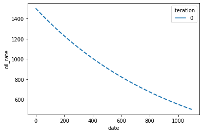
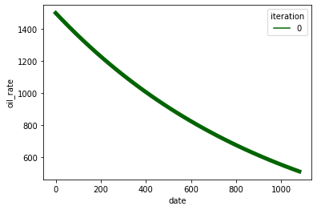
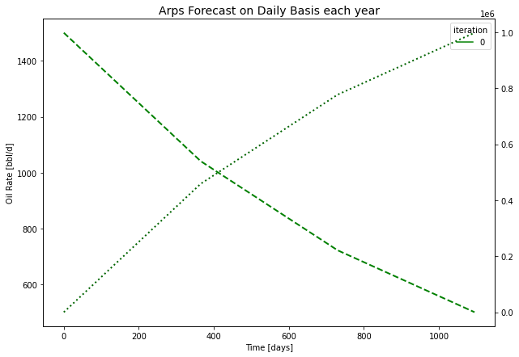
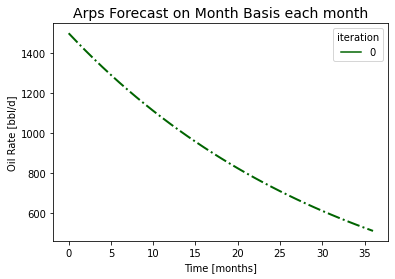
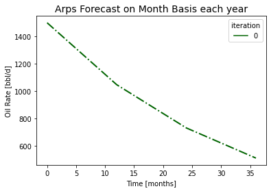
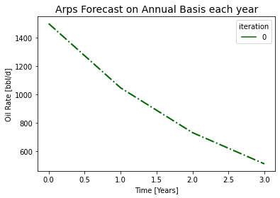
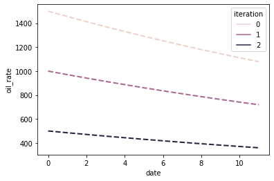
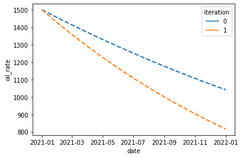

# Dcapy -  Arps Class

This section introduces the `Arps` class which is a *'wrapper'* for the Arps Function seen in the previous section. It add certain functionalities to the forecast estimation, like dates, plots, cumulatives, water calculation.  

By taking advantage of python Object-Oriented functionalities it is very convinient to define a class with the required properties to make an Arps declination analysis. With the class are defined methods that help to make the forecast in a very flexible way. That means you can make different kind of forecast from the same Arps declination parameters. 


```python
import os
from dcapy import dca
import numpy as np 
import pandas as pd
from datetime import date
import matplotlib.pyplot as plt
import seaborn as sns 
from scipy import stats
np.seterr(divide='ignore')
```


    {'divide': 'warn', 'over': 'warn', 'under': 'ignore', 'invalid': 'warn'}


## Arps Class

As seen in the previous section to define an Arps declination object you must have a *Decline rate* `di`, *b coefficient* `b`, *Initial Time* `Ti`, *Initial rate* `qi`. With these properties you can create a simple Arps Class. The time array to make a forecast can vary depending on the horizon time, frequency or rates limits. In that way you can estimate multiple forecast from the same class depending on the needs. 

Let's define a simple Aprs class by providing the same properties we have been seen. 
We can add a property we had not seen so far which is useful when we incorporates different time units. The units of the declination rate `di`. So far we can handle three periods of time. Days, Months and years.


```python
# Define a Simple Arps Class

a1 = dca.Arps(
    ti = 0,
    di = 0.03,
    qi = 1500,
    b = 0,
    freq_di='M'
)

print(a1)

```

    Declination 
     Ti: 0 
     Qi: 1500.0 bbl/d 
     Di: 0.03 M 
     b: 0.0


We have defined a Arps class with a nominal declination rate of 0.03 monthly. This is usefull if you want to make a forecast on differnt time basis. You can get forecast on daily, monthly or annual basis from the same Arps Class

### Time basis 

When the time is defined with integers, they can represent any of the periods available (days, months or years). For example you can define forecast on daily basis each day or on daily basis each month. Next are the different ways you can create forecast

By calling the method `forecast` and providing either a time array or the start and end, and the frequencies of the output it returns a pandas DataFrame with the forecast with some useful metadata


```python
print('Calculate Daily Basis each day')

fr = a1.forecast(start=0,end=1095,freq_input='D',freq_output='D')
print(fr)
```

    Calculate Daily Basis each day
             oil_rate        oil_cum  iteration   oil_volume
    date                                                    
    0     1500.000000       0.000000          0  1499.250250
    1     1498.500750    1499.250250          0  1498.501000
    2     1497.002998    2997.001999          0  1497.003248
    3     1495.506743    4493.256745          0  1495.506993
    4     1494.011984    5988.015984          0  1494.012233
    ...           ...            ...        ...          ...
    1090   504.324741  995675.259440          0   504.324825
    1091   503.820668  996179.332102          0   503.820752
    1092   503.317099  996682.900944          0   503.317183
    1093   502.814034  997185.966468          0   502.814117
    1094   502.311471  997688.529178          0   502.562710
    
    [1095 rows x 4 columns]


Let's Plot it instead


```python
print('Calculate Daily Basis each day - Plot')

fr = a1.plot(start=0,end=1095,freq_input='D',freq_output='D')
```

    Calculate Daily Basis each day - Plot


    

    


Generate forecast with more periods alternatives


```python
print('Calculate Daily Basis each Month')

fr = a1.forecast(start=0,end=1096,freq_input='D',freq_output='M')
print(fr)

a1.plot(start=0,end=1096,freq_input='D',freq_output='M',rate_kw=dict(palette=['darkgreen'],linestyle='-',linewidth=5))
```

    Calculate Daily Basis each Month
             oil_rate        oil_cum  iteration    oil_volume
    date                                                     
    0     1500.000000       0.000000          0  44331.699677
    30    1455.668300   44331.699677          0  43676.599812
    60    1412.646800   87353.199624          0  42385.761208
    90    1370.896778  129103.222093          0  41133.072650
    120   1330.380655  169619.344924          0  39917.406635
    150   1291.061965  208938.035362          0  38737.668979
    180   1252.905317  247094.682883          0  37592.797841
    210   1215.876369  284123.631045          0  36481.762759
    240   1179.941792  320058.208400          0  35403.563725
    270   1145.069242  354930.758495          0  34357.230289
    300   1111.227331  388772.668977          0  33341.820679
    330   1078.385600  421614.399852          0  32356.420958
    360   1046.514489  453485.510893          0  31400.144200
    390   1015.585312  484414.688253          0  30472.129692
    420    985.570230  514429.770277          0  29571.542157
    450    956.442227  543557.772567          0  28697.571007
    480    928.175088  571824.912291          0  27849.429607
    510    900.743368  599256.631782          0  27026.354574
    540    874.122379  625877.621439          0  26227.605085
    570    848.288158  651711.841951          0  25452.462210
    600    823.217454  676782.545859          0  24700.228269
    630    798.887702  701112.298490          0  23970.226202
    660    775.277002  724722.998262          0  23261.798956
    690    752.364104  747635.896401          0  22574.308899
    720    730.128384  769871.616060          0  21907.137244
    750    708.549829  791450.170888          0  21259.683491
    780    687.609017  812390.983042          0  20631.364889
    810    667.287099  832712.900666          0  20021.615907
    840    647.565785  852434.214856          0  19429.887731
    870    628.427324  871572.676129          0  18855.647766
    900    609.854490  890145.510389          0  18298.379157
    930    591.830566  908169.434443          0  17757.580324
    960    574.339329  925660.671037          0  17232.764512
    990    557.365037  942634.963467          0  16723.459352
    1020   540.892410  959107.589740          0  16229.206433
    1050   524.906624  975093.376333          0  15749.560896
    1080   509.393288  990606.711533          0  15513.335199


    

    


```python
print('Calculate Daily Basis each Year')

fr = a1.forecast(start=0,end=1096,freq_input='D',freq_output='A')
print(fr)

#Assign to a matplotlib axes
fig, ax = plt.subplots(figsize=(10,7))

a1.plot(start=0,end=1096,freq_input='D',freq_output='A',cum=True,rate_kw = {'palette':['green']}, ax=ax)
ax.set_title('Arps Forecast on Daily Basis each year', fontsize=14)
ax.set_xlabel('Time [days]', fontsize=10)
ax.set_ylabel('Oil Rate [bbl/d]', fontsize=10)
```

    Calculate Daily Basis each Year
             oil_rate        oil_cum  iteration     oil_volume
    date                                                      
    0     1500.000000       0.000000          0  458705.023683
    365   1041.294976  458705.023683          0  388568.257432
    730    722.863485  777136.514865          0  269742.782947
    1095   501.809410  998190.589577          0  221054.074712


    Text(0, 0.5, 'Oil Rate [bbl/d]')


    

    


```python
print('Calculate Monthly Basis each Month')

fr = a1.forecast(start=0,end=37,freq_input='M',freq_output='M')
print(fr)

fig, ax = plt.subplots()
a1.plot(start=0,end=37,freq_input='M',freq_output='M',rate_kw=dict(palette=['darkgreen'],linestyle='-.',linewidth=2))
ax.set_title('Arps Forecast on Month Basis each month', fontsize=14)
ax.set_xlabel('Time [months]', fontsize=10)
ax.set_ylabel('Oil Rate [bbl/d]', fontsize=10)

```

    Calculate Monthly Basis each Month
             oil_rate        oil_cum  iteration    oil_volume
    date                                                     
    0     1500.000000       0.000000          0  44331.699677
    1     1455.668300   44331.699677          0  43676.599812
    2     1412.646800   87353.199624          0  42385.761208
    3     1370.896778  129103.222093          0  41133.072650
    4     1330.380655  169619.344924          0  39917.406635
    5     1291.061965  208938.035362          0  38737.668979
    6     1252.905317  247094.682883          0  37592.797841
    7     1215.876369  284123.631045          0  36481.762759
    8     1179.941792  320058.208400          0  35403.563725
    9     1145.069242  354930.758495          0  34357.230289
    10    1111.227331  388772.668977          0  33341.820679
    11    1078.385600  421614.399852          0  32356.420958
    12    1046.514489  453485.510893          0  31400.144200
    13    1015.585312  484414.688253          0  30472.129692
    14     985.570230  514429.770277          0  29571.542157
    15     956.442227  543557.772567          0  28697.571007
    16     928.175088  571824.912291          0  27849.429607
    17     900.743368  599256.631782          0  27026.354574
    18     874.122379  625877.621439          0  26227.605085
    19     848.288158  651711.841951          0  25452.462210
    20     823.217454  676782.545859          0  24700.228269
    21     798.887702  701112.298490          0  23970.226202
    22     775.277002  724722.998262          0  23261.798956
    23     752.364104  747635.896401          0  22574.308899
    24     730.128384  769871.616060          0  21907.137244
    25     708.549829  791450.170888          0  21259.683491
    26     687.609017  812390.983042          0  20631.364889
    27     667.287099  832712.900666          0  20021.615907
    28     647.565785  852434.214856          0  19429.887731
    29     628.427324  871572.676129          0  18855.647766
    30     609.854490  890145.510389          0  18298.379157
    31     591.830566  908169.434443          0  17757.580324
    32     574.339329  925660.671037          0  17232.764512
    33     557.365037  942634.963467          0  16723.459352
    34     540.892410  959107.589740          0  16229.206433
    35     524.906624  975093.376333          0  15749.560896
    36     509.393288  990606.711533          0  15513.335199


    Text(0, 0.5, 'Oil Rate [bbl/d]')


    

    


```python
print('Calculate Monthly Basis each Year')

fr = a1.forecast(start=0,end=37,freq_input='M',freq_output='A')
print(fr)

fig, ax = plt.subplots()
a1.plot(start=0,end=37,freq_input='M',freq_output='A',rate_kw=dict(palette=['darkgreen'],linestyle='-.',linewidth=2))
ax.set_title('Arps Forecast on Month Basis each year', fontsize=14)
ax.set_xlabel('Time [months]', fontsize=10)
ax.set_ylabel('Oil Rate [bbl/d]', fontsize=10)
```

    Calculate Monthly Basis each Year
             oil_rate        oil_cum  iteration     oil_volume
    date                                                      
    0     1500.000000       0.000000          0  453485.510893
    12    1046.514489  453485.510893          0  384935.808030
    24     730.128384  769871.616060          0  268560.600320
    36     509.393288  990606.711533          0  220735.095473


    Text(0, 0.5, 'Oil Rate [bbl/d]')


    

    


```python
print('Calculate Annual Basis each Year')

fr = a1.forecast(start=0,end=4,freq_input='A',freq_output='A')
print(fr)

fig, ax = plt.subplots()
a1.plot(start=0,end=4,freq_input='A',freq_output='A',rate_kw=dict(palette=['darkgreen'],linestyle='-.',linewidth=2))
ax.set_title('Arps Forecast on Annual Basis each year', fontsize=14)
ax.set_xlabel('Time [Years]', fontsize=10)
ax.set_ylabel('Oil Rate [bbl/d]', fontsize=10)
```

    Calculate Annual Basis each Year
             oil_rate       oil_cum  iteration     oil_volume
    date                                                     
    0     1500.000000  0.000000e+00          0  459783.920767
    1     1046.514489  4.597839e+05          0  390282.138697
    2      730.128384  7.805643e+05          0  272290.608657
    3      509.393288  1.004365e+06          0  223800.860687


    Text(0, 0.5, 'Oil Rate [bbl/d]')


    

    


## Multiple Values 

You may have noticed that the pandas dataframe returned with the forecast has a column name *iteration*. As we have defined so far a singles parameters for the Arps class it is created only one iteration. 

You can declare Multiple values for any of the Arps parameters and they will result on Multiple iteration on the pandas dataframe.


```python
# Define an Arps Class with multiple values

a2 = dca.Arps(
    ti = 0,
    di = 0.03,
    qi = [1500,1000,500],
    b = 0,
    freq_di='M'
)

print(a2)
```

    Declination 
     Ti: 0 
     Qi: [1500.0, 1000.0, 500.0] bbl/d 
     Di: 0.03 M 
     b: 0.0


```python
print('Calculate Monthly Basis each month - Multiple parameters')

fr = a2.forecast(start=0,end=12,freq_input='M',freq_output='M')
print(fr)

fig, ax = plt.subplots()
a2.plot(start=0,end=12,freq_input='M',freq_output='M')

```

    Calculate Monthly Basis each month - Multiple parameters
             oil_rate        oil_cum  iteration    oil_volume
    date                                                     
    0     1500.000000       0.000000          0  44331.699677
    1     1455.668300   44331.699677          0  43676.599812
    2     1412.646800   87353.199624          0  42385.761208
    3     1370.896778  129103.222093          0  41133.072650
    4     1330.380655  169619.344924          0  39917.406635
    5     1291.061965  208938.035362          0  38737.668979
    6     1252.905317  247094.682883          0  37592.797841
    7     1215.876369  284123.631045          0  36481.762759
    8     1179.941792  320058.208400          0  35403.563725
    9     1145.069242  354930.758495          0  34357.230289
    10    1111.227331  388772.668977          0  33341.820679
    11    1078.385600  421614.399852          0  32841.730875
    0     1000.000000       0.000000          1  29554.466451
    1      970.445534   29554.466451          1  29117.733208
    2      941.764534   58235.466416          1  28257.174139
    3      913.931185   86068.814729          1  27422.048434
    4      886.920437  113079.563283          1  26611.604423
    5      860.707976  139292.023575          1  25825.112653
    6      835.270211  164729.788589          1  25061.865227
    7      810.584246  189415.754030          1  24321.175172
    8      786.627861  213372.138933          1  23602.375817
    9      763.379494  236620.505663          1  22904.820192
    10     740.818221  259181.779318          1  22227.880452
    11     718.923733  281076.266568          1  21894.487250
    0      500.000000       0.000000          2  14777.233226
    1      485.222767   14777.233226          2  14558.866604
    2      470.882267   29117.733208          2  14128.587069
    3      456.965593   43034.407364          2  13711.024217
    4      443.460218   56539.781641          2  13305.802212
    5      430.353988   69646.011787          2  12912.556326
    6      417.635106   82364.894294          2  12530.932614
    7      405.292123   94707.877015          2  12160.587586
    8      393.313931  106686.069467          2  11801.187908
    9      381.689747  118310.252832          2  11452.410096
    10     370.409110  129590.889659          2  11113.940226
    11     359.461867  140538.133284          2  10947.243625


    

    


### Estimate Water Rate.

You can add water columns for the returning forecast by providing either a fluid rate or water cut. When any of them is provided the function assumes they are constant and the water estimation are simple substraction.


```python
# Define an Arps Class with multiple values - Fluid rate

a3 = dca.Arps(
    ti = 0,
    di = 0.03,
    qi = [1500,1450],
    b = [0,1],
    freq_di='M', 
    fluid_rate = 2000
)

fr = a3.forecast(start=0,end=12,freq_input='M',freq_output='M')
print(fr)
```

             oil_rate        oil_cum  iteration    oil_volume  fluid_rate  \
    date                                                                    
    0     1500.000000       0.000000          0  44331.699677      2000.0   
    1     1455.668300   44331.699677          0  43676.599812      2000.0   
    2     1412.646800   87353.199624          0  42385.761208      2000.0   
    3     1370.896778  129103.222093          0  41133.072650      2000.0   
    4     1330.380655  169619.344924          0  39917.406635      2000.0   
    5     1291.061965  208938.035362          0  38737.668979      2000.0   
    6     1252.905317  247094.682883          0  37592.797841      2000.0   
    7     1215.876369  284123.631045          0  36481.762759      2000.0   
    8     1179.941792  320058.208400          0  35403.563725      2000.0   
    9     1145.069242  354930.758495          0  34357.230289      2000.0   
    10    1111.227331  388772.668977          0  33341.820679      2000.0   
    11    1078.385600  421614.399852          0  32841.730875      2000.0   
    0     1450.000000       0.000000          1  42860.263250      2000.0   
    1     1407.766990   42860.263250          1  42244.958390      2000.0   
    2     1367.924528   84489.916780          1  41048.698150      2000.0   
    3     1330.275229  124957.659550          1  39918.338458      2000.0   
    4     1294.642857  164326.593695          1  38848.578447      2000.0   
    5     1260.869565  202654.816444          1  37834.671049      2000.0   
    6     1228.813559  239995.935792          1  36872.352494      2000.0   
    7     1198.347107  276399.521433          1  35957.782326      2000.0   
    8     1169.354839  311911.500445          1  35087.492125      2000.0   
    9     1141.732283  346574.505682          1  34258.341517      2000.0   
    10    1115.384615  380428.183478          1  33467.480278      2000.0   
    11    1090.225564  413509.466239          1  33081.282761      2000.0   
    
          water_rate       bsw       wor      water_cum  fluid_cum  water_volume  \
    date                                                                           
    0     500.000000  0.250000  0.333333       0.000000        0.0  16329.950990   
    1     544.331700  0.272166  0.373939   16329.950990    60000.0  16975.273490   
    2     587.353200  0.293677  0.415782   33950.546979   120000.0  18246.846326   
    3     629.103222  0.314552  0.458899   52823.643642   180000.0  19480.838505   
    4     669.619345  0.334810  0.503329   72912.223990   240000.0  20678.360704   
    5     708.938035  0.354469  0.549112   94180.365050   300000.0  21840.490774   
    6     747.094683  0.373547  0.596290  116593.205537   360000.0  22968.274709   
    7     784.123631  0.392062  0.644904  140116.914468   420000.0  24062.727592   
    8     820.058208  0.410029  0.694999  164718.660720   480000.0  25124.834503   
    9     854.930758  0.427465  0.746619  190366.583475   540000.0  26155.551412   
    10    888.772669  0.444386  0.799812  217029.763544   600000.0  27155.806032   
    11    921.614400  0.460807  0.854624  244678.195540   660000.0  27648.431996   
    0     550.000000  0.275000  0.379310       0.000000        0.0  17766.990291   
    1     592.233010  0.296117  0.420690   17766.990291    60000.0  18364.627221   
    2     632.075472  0.316038  0.462069   36729.254442   120000.0  19527.003635   
    3     669.724771  0.334862  0.503448   56820.997561   180000.0  20626.228702   
    4     705.357143  0.352679  0.544828   77981.711847   240000.0  21667.313665   
    5     739.130435  0.369565  0.586207  100155.624891   300000.0  22654.753132   
    6     771.186441  0.385593  0.627586  123291.218111   360000.0  23592.589999   
    7     801.652893  0.400826  0.668966  147340.804888   420000.0  24484.470808   
    8     830.645161  0.415323  0.710345  172260.159727   480000.0  25333.693167   
    9     858.267717  0.429134  0.751724  198008.191223   540000.0  26143.246517   
    10    884.615385  0.442308  0.793103  224546.652761   600000.0  26915.847311   
    11    909.774436  0.454887  0.834483  251839.885844   660000.0  27293.233083   
    
          fluid_volume  
    date                
    0          60000.0  
    1          60000.0  
    2          60000.0  
    3          60000.0  
    4          60000.0  
    5          60000.0  
    6          60000.0  
    7          60000.0  
    8          60000.0  
    9          60000.0  
    10         60000.0  
    11         60000.0  
    0          60000.0  
    1          60000.0  
    2          60000.0  
    3          60000.0  
    4          60000.0  
    5          60000.0  
    6          60000.0  
    7          60000.0  
    8          60000.0  
    9          60000.0  
    10         60000.0  
    11         60000.0  


    /home/scuervo/Documents/dev/apps/dcapy/dcapy/dca/arps.py:82: RuntimeWarning: invalid value encountered in multiply
      return f*(g-h)


```python
a4 = dca.Arps(
    ti = 0,
    di = 0.03,
    qi = [1500,1450],
    b = [0,1],
    freq_di='M', 
    bsw = 0.6
)

fr = a4.forecast(start=0,end=12,freq_input='M',freq_output='M')
print(fr)
```

             oil_rate        oil_cum  iteration    oil_volume  bsw   water_rate  \
    date                                                                          
    0     1500.000000       0.000000          0  44331.699677  0.6  2250.000000   
    1     1455.668300   44331.699677          0  43676.599812  0.6  2183.502450   
    2     1412.646800   87353.199624          0  42385.761208  0.6  2118.970201   
    3     1370.896778  129103.222093          0  41133.072650  0.6  2056.345167   
    4     1330.380655  169619.344924          0  39917.406635  0.6  1995.570983   
    5     1291.061965  208938.035362          0  38737.668979  0.6  1936.592947   
    6     1252.905317  247094.682883          0  37592.797841  0.6  1879.357976   
    7     1215.876369  284123.631045          0  36481.762759  0.6  1823.814553   
    8     1179.941792  320058.208400          0  35403.563725  0.6  1769.912687   
    9     1145.069242  354930.758495          0  34357.230289  0.6  1717.603862   
    10    1111.227331  388772.668977          0  33341.820679  0.6  1666.840997   
    11    1078.385600  421614.399852          0  32841.730875  0.6  1617.578400   
    0     1450.000000       0.000000          1  42860.263250  0.6  2175.000000   
    1     1407.766990   42860.263250          1  42244.958390  0.6  2111.650485   
    2     1367.924528   84489.916780          1  41048.698150  0.6  2051.886792   
    3     1330.275229  124957.659550          1  39918.338458  0.6  1995.412844   
    4     1294.642857  164326.593695          1  38848.578447  0.6  1941.964286   
    5     1260.869565  202654.816444          1  37834.671049  0.6  1891.304348   
    6     1228.813559  239995.935792          1  36872.352494  0.6  1843.220339   
    7     1198.347107  276399.521433          1  35957.782326  0.6  1797.520661   
    8     1169.354839  311911.500445          1  35087.492125  0.6  1754.032258   
    9     1141.732283  346574.505682          1  34258.341517  0.6  1712.598425   
    10    1115.384615  380428.183478          1  33467.480278  0.6  1673.076923   
    11    1090.225564  413509.466239          1  33081.282761  0.6  1635.338346   
    
           fluid_rate  wor      water_cum     fluid_cum  water_volume  \
    date                                                                
    0     3750.000000  1.5       0.000000  0.000000e+00  65505.073515   
    1     3639.170751  1.5   65505.073515  1.091751e+05  64537.089766   
    2     3531.617001  1.5  129074.179531  2.151236e+05  62629.730511   
    3     3427.241945  1.5  190764.534537  3.179409e+05  60778.742242   
    4     3325.951638  1.5  250631.664016  4.177194e+05  58982.458944   
    5     3227.654912  1.5  308729.452424  5.145491e+05  57239.263839   
    6     3132.263293  1.5  365110.191695  6.085170e+05  55547.587937   
    7     3039.690922  1.5  419824.628298  6.997077e+05  53905.908612   
    8     2949.854479  1.5  472922.008920  7.882033e+05  52312.748245   
    9     2862.673104  1.5  524450.124787  8.740835e+05  50766.672882   
    10    2778.068328  1.5  574455.354683  9.574256e+05  49266.290951   
    11    2695.964000  1.5  622982.706690  1.038305e+06  48527.352007   
    0     3625.000000  1.5       0.000000  0.000000e+00  63349.514563   
    1     3519.417476  1.5   63349.514563  1.055825e+05  62453.059168   
    2     3419.811321  1.5  124906.118337  2.081769e+05  60709.494547   
    3     3325.688073  1.5  184768.503658  3.079475e+05  59060.656946   
    4     3236.607143  1.5  243027.432229  4.050457e+05  57499.029503   
    5     3152.173913  1.5  299766.562664  4.996109e+05  56017.870302   
    6     3072.033898  1.5  355063.172833  5.917720e+05  54611.115002   
    7     2995.867769  1.5  408988.792668  6.816480e+05  53273.293788   
    8     2923.387097  1.5  461609.760410  7.693496e+05  51999.460249   
    9     2854.330709  1.5  512987.713166  8.549795e+05  50785.130224   
    10    2788.461538  1.5  563180.020858  9.386334e+05  49626.229034   
    11    2725.563910  1.5  612240.171234  1.020400e+06  49060.150376   
    
           fluid_volume  
    date                 
    0     109175.122524  
    1     107561.816276  
    2     104382.884186  
    3     101297.903737  
    4      98304.098239  
    5      95398.773066  
    6      92579.313228  
    7      89843.181021  
    8      87187.913741  
    9      84611.121470  
    10     82110.484919  
    11     80878.920011  
    0     105582.524272  
    1     104088.431947  
    2     101182.490912  
    3      98434.428244  
    4      95831.715839  
    5      93363.117170  
    6      91018.525004  
    7      88788.822981  
    8      86665.767082  
    9      84641.883707  
    10     82710.381724  
    11     81766.917293  


    /home/scuervo/Documents/dev/apps/dcapy/dcapy/dca/arps.py:82: RuntimeWarning: invalid value encountered in multiply
      return f*(g-h)


Remember you can pass a time list with a custom time distribution


```python
fr = a4.forecast(time_list=[0,2,3,4,6,8,12],freq_input='M',freq_output='M')
print(fr)
```

             oil_rate        oil_cum  iteration     oil_volume  bsw   water_rate  \
    date                                                                           
    0     1500.000000       0.000000          0   87353.199624  0.6  2250.000000   
    2     1412.646800   87353.199624          0   64551.611047  0.6  2118.970201   
    3     1370.896778  129103.222093          0   41133.072650  0.6  2056.345167   
    4     1330.380655  169619.344924          0   58995.730395  0.6  1995.570983   
    6     1252.905317  247094.682883          0   75219.431738  0.6  1879.357976   
    8     1179.941792  320058.208400          0  103195.414005  0.6  1769.912687   
    12    1046.514489  453485.510893          0  133427.302493  0.6  1569.771734   
    0     1450.000000       0.000000          1   84489.916780  0.6  2175.000000   
    2     1367.924528   84489.916780          1   62478.829775  0.6  2051.886792   
    3     1330.275229  124957.659550          1   39918.338458  0.6  1995.412844   
    4     1294.642857  164326.593695          1   57519.138121  0.6  1941.964286   
    6     1228.813559  239995.935792          1   73792.453375  0.6  1843.220339   
    8     1169.354839  311911.500445          1  102928.439421  0.6  1754.032258   
    12    1066.176471  445852.814635          1  133941.314190  0.6  1599.264706   
    
           fluid_rate  wor      water_cum     fluid_cum   water_volume  \
    date                                                                 
    0     3750.000000  1.5       0.000000  0.000000e+00  127138.212034   
    2     3531.617001  1.5  127138.212034  2.118970e+05   94414.283520   
    3     3427.241945  1.5  188828.567040  3.147143e+05   60778.742242   
    4     3325.951638  1.5  248695.696518  4.144928e+05   86314.304009   
    6     3132.263293  1.5  361457.175059  6.024286e+05  109478.119892   
    8     2949.854479  1.5  467651.936303  7.794199e+05  147283.684642   
    12    2616.286223  1.5  656024.544342  1.093374e+06  188372.608039   
    0     3625.000000  1.5       0.000000  0.000000e+00  123113.207547   
    2     3419.811321  1.5  123113.207547  2.051887e+05   91487.796434   
    3     3325.688073  1.5  182975.592868  3.049593e+05   59060.656946   
    4     3236.607143  1.5  241234.521440  4.020575e+05   84426.074455   
    6     3072.033898  1.5  351827.741779  5.863796e+05  107917.577911   
    8     2923.387097  1.5  457069.677263  7.617828e+05  148576.850095   
    12    2665.441176  1.5  648981.441968  1.081636e+06  191911.764706   
    
           fluid_volume  
    date                 
    0     211897.020056  
    2     157357.139200  
    3     101297.903737  
    4     143857.173349  
    6     182463.533154  
    8     245472.807736  
    12    313954.346732  
    0     205188.679245  
    2     152479.660724  
    3      98434.428244  
    4     140710.124092  
    6     179862.629852  
    8     247628.083491  
    12    319852.941176  


    /home/scuervo/Documents/dev/apps/dcapy/dcapy/dca/arps.py:82: RuntimeWarning: invalid value encountered in multiply
      return f*(g-h)


### Using Arps class with dates

You can also define the Arps class with dates. Like before, the output frequency approach also works


```python
a5 = dca.Arps(
    ti = date(2021,1,1),
    di = [0.03,0.05],
    qi = 1500,
    b = 0,
    freq_di='M', 
    fluid_rate = 2000
)
print(a5)
```

    Declination 
     Ti: 2021-01-01 
     Qi: 1500.0 bbl/d 
     Di: [0.03, 0.05] M 
     b: 0.0


```python
fr = a5.forecast(start=date(2021,1,1),end=date(2021,1,10),freq_output='D')
print(fr)
```

                   oil_rate       oil_cum  iteration   oil_volume  fluid_rate  \
    date                                                                        
    2021-01-01  1500.000000      0.000000          0  1499.250250      2000.0   
    2021-01-02  1498.500750   1499.250250          0  1498.501000      2000.0   
    2021-01-03  1497.002998   2997.001999          0  1497.003248      2000.0   
    2021-01-04  1495.506743   4493.256745          0  1495.506993      2000.0   
    2021-01-05  1494.011984   5988.015984          0  1494.012233      2000.0   
    2021-01-06  1492.518719   7481.281211          0  1492.518968      2000.0   
    2021-01-07  1491.026946   8973.053919          0  1491.027195      2000.0   
    2021-01-08  1489.536664  10463.335600          0  1489.536913      2000.0   
    2021-01-09  1488.047872  11952.127744          0  1488.048120      2000.0   
    2021-01-10  1486.560568  13439.431841          0  1487.304096      2000.0   
    2021-01-01  1500.000000      0.000000          1  1498.750694      2000.0   
    2021-01-02  1497.502082   1498.750694          1  1497.502775      2000.0   
    2021-01-03  1495.008324   2995.005551          1  1495.009016      2000.0   
    2021-01-04  1492.518719   4488.768727          1  1492.519410      2000.0   
    2021-01-05  1490.033259   5980.044370          1  1490.033949      2000.0   
    2021-01-06  1487.551939   7468.836625          1  1487.552628      2000.0   
    2021-01-07  1485.074751   8955.149626          1  1485.075438      2000.0   
    2021-01-08  1482.601687  10438.987501          1  1482.602374      2000.0   
    2021-01-09  1480.132743  11920.354374          1  1480.133428      2000.0   
    2021-01-10  1477.667909  13399.254357          1  1478.899984      2000.0   
    
                water_rate       bsw       wor    water_cum  fluid_cum  \
    date                                                                 
    2021-01-01  500.000000  0.250000  0.333333     0.000000        0.0   
    2021-01-02  501.499250  0.250750  0.334667   501.499250     2000.0   
    2021-01-03  502.997002  0.251499  0.336003  1004.496252     4000.0   
    2021-01-04  504.493257  0.252247  0.337339  1508.989509     6000.0   
    2021-01-05  505.988016  0.252994  0.338677  2014.977525     8000.0   
    2021-01-06  507.481281  0.253741  0.340017  2522.458806    10000.0   
    2021-01-07  508.973054  0.254487  0.341357  3031.431860    12000.0   
    2021-01-08  510.463336  0.255232  0.342699  3541.895196    14000.0   
    2021-01-09  511.952128  0.255976  0.344043  4053.847323    16000.0   
    2021-01-10  513.439432  0.256720  0.345387  4567.286755    18000.0   
    2021-01-01  500.000000  0.250000  0.333333     0.000000        0.0   
    2021-01-02  502.497918  0.251249  0.335557   502.497918     2000.0   
    2021-01-03  504.991676  0.252496  0.337785  1007.489594     4000.0   
    2021-01-04  507.481281  0.253741  0.340017  1514.970875     6000.0   
    2021-01-05  509.966741  0.254983  0.342252  2024.937616     8000.0   
    2021-01-06  512.448061  0.256224  0.344491  2537.385677    10000.0   
    2021-01-07  514.925249  0.257463  0.346734  3052.310926    12000.0   
    2021-01-08  517.398313  0.258699  0.348980  3569.709238    14000.0   
    2021-01-09  519.867257  0.259934  0.351230  4089.576496    16000.0   
    2021-01-10  522.332091  0.261166  0.353484  4611.908586    18000.0   
    
                water_volume  fluid_volume  
    date                                    
    2021-01-01    501.499250        2000.0  
    2021-01-02    502.248126        2000.0  
    2021-01-03    503.745129        2000.0  
    2021-01-04    505.240636        2000.0  
    2021-01-05    506.734649        2000.0  
    2021-01-06    508.227168        2000.0  
    2021-01-07    509.718195        2000.0  
    2021-01-08    511.207732        2000.0  
    2021-01-09    512.695780        2000.0  
    2021-01-10    513.439432        2000.0  
    2021-01-01    502.497918        2000.0  
    2021-01-02    503.744797        2000.0  
    2021-01-03    506.236479        2000.0  
    2021-01-04    508.724011        2000.0  
    2021-01-05    511.207401        2000.0  
    2021-01-06    513.686655        2000.0  
    2021-01-07    516.161781        2000.0  
    2021-01-08    518.632785        2000.0  
    2021-01-09    521.099674        2000.0  
    2021-01-10    522.332091        2000.0  


```python
fr = a5.forecast(start=date(2021,1,1),end=date(2022,1,1),freq_output='M')
print(fr)
```

                oil_rate        oil_cum  iteration    oil_volume  fluid_rate  \
    date                                                                       
    2021-01  1500.000000       0.000000          0  45786.640386      2000.0   
    2021-02  1454.213360   45786.640386          0  42969.923132      2000.0   
    2021-03  1414.060154   85939.846264          0  41658.290854      2000.0   
    2021-04  1370.896778  129103.222093          0  41839.749330      2000.0   
    2021-05  1330.380655  169619.344924          0  40562.614959      2000.0   
    2021-06  1289.771548  210228.452011          0  39363.808516      2000.0   
    2021-07  1251.653038  248346.961956          0  38162.250820      2000.0   
    2021-08  1213.447046  286552.953650          0  37622.883693      2000.0   
    2021-09  1176.407271  323592.729343          0  35903.932453      2000.0   
    2021-10  1141.639181  358360.818557          0  34807.985491      2000.0   
    2021-11  1106.791300  393208.700324          0  33779.254051      2000.0   
    2021-12  1074.080673  425919.326659          0  32748.161679      2000.0   
    2022-01  1041.294976  458705.023683          0  32785.697024      2000.0   
    2021-01  1500.000000       0.000000          1  45319.173710      2000.0   
    2021-02  1424.468044   45319.173710          1  42143.967983      2000.0   
    2021-03  1359.520107   84287.935965          1  40021.823754      2000.0   
    2021-04  1291.061965  125362.821217          1  39427.193132      2000.0   
    2021-05  1228.096130  163142.322230          1  37441.851116      2000.0   
    2021-06  1166.255794  200246.523450          1  35615.790490      2000.0   
    2021-07  1109.376828  234373.903209          1  33822.370272      2000.0   
    2021-08  1053.514560  267891.263994          1  32673.483509      2000.0   
    2021-09  1000.465216  299720.870227          1  30552.782427      2000.0   
    2021-10   951.671952  328996.828847          1  29014.308144      2000.0   
    2021-11   903.750856  357749.486516          1  27599.263638      2000.0   
    2021-12   859.674406  384195.356123          1  26209.512724      2000.0   
    2022-01   816.385813  410168.511963          1  25973.155840      2000.0   
    
              water_rate       bsw       wor      water_cum  fluid_cum  \
    date                                                                 
    2021-01   500.000000  0.250000  0.333333       0.000000        0.0   
    2021-02   545.786640  0.272893  0.375314   16919.385852    62000.0   
    2021-03   585.939846  0.292970  0.414367   33325.701547   118000.0   
    2021-04   629.103222  0.314552  0.458899   52827.901432   180000.0   
    2021-05   669.619345  0.334810  0.503329   72916.481780   240000.0   
    2021-06   710.228452  0.355114  0.550662   94933.563792   302000.0   
    2021-07   748.346962  0.374173  0.597887  117383.972651   362000.0   
    2021-08   786.552954  0.393276  0.648197  141767.114214   424000.0   
    2021-09   823.592729  0.411796  0.700091  167298.488824   486000.0   
    2021-10   858.360819  0.429180  0.751867  193049.313380   546000.0   
    2021-11   893.208700  0.446604  0.807025  220738.783091   608000.0   
    2021-12   925.919327  0.462960  0.862058  248516.362890   668000.0   
    2022-01   958.705024  0.479353  0.920685  278236.218624   730000.0   
    2021-01   500.000000  0.250000  0.333333       0.000000        0.0   
    2021-02   575.531956  0.287766  0.404033   17841.490642    62000.0   
    2021-03   640.479893  0.320240  0.471107   35774.927653   118000.0   
    2021-04   708.938035  0.354469  0.549112   57752.006750   180000.0   
    2021-05   771.903870  0.385952  0.628537   80909.122861   240000.0   
    2021-06   833.744206  0.416872  0.714890  106755.193239   302000.0   
    2021-07   890.623172  0.445312  0.802814  133473.888400   362000.0   
    2021-08   946.485440  0.473243  0.898408  162814.937039   424000.0   
    2021-09   999.534784  0.499767  0.999070  193800.515335   486000.0   
    2021-10  1048.328048  0.524164  1.101565  225250.356777   546000.0   
    2021-11  1096.249144  0.548125  1.212999  259234.080247   608000.0   
    2021-12  1140.325594  0.570163  1.326462  293443.848053   668000.0   
    2022-01  1183.614187  0.591807  1.449822  330135.887838   730000.0   
    
             water_volume  fluid_volume  
    date                                 
    2021-01  16919.385852       62000.0  
    2021-02  16662.850774       59000.0  
    2021-03  17954.257790       59000.0  
    2021-04  19795.390116       61000.0  
    2021-05  21052.831180       61000.0  
    2021-06  22233.745436       61000.0  
    2021-07  23416.775211       61000.0  
    2021-08  24957.258086       62000.0  
    2021-09  25641.099583       61000.0  
    2021-10  26720.147133       61000.0  
    2021-11  27733.524755       61000.0  
    2021-12  28748.717767       61000.0  
    2022-01  29719.855734       62000.0  
    2021-01  17841.490642       62000.0  
    2021-02  17887.463827       59000.0  
    2021-03  19955.258054       59000.0  
    2021-04  22567.097604       61000.0  
    2021-05  24501.593245       61000.0  
    2021-06  26282.382769       61000.0  
    2021-07  28029.871900       61000.0  
    2021-08  30163.313467       62000.0  
    2021-09  31217.709869       61000.0  
    2021-10  32716.782456       61000.0  
    2021-11  34096.745638       61000.0  
    2021-12  35450.903795       61000.0  
    2022-01  36692.039785       62000.0  


```python
fr = a5.forecast(start=date(2021,1,1),end=date(2026,1,1),freq_output='A')
print(fr)
```

             oil_rate       oil_cum  iteration     oil_volume  fluid_rate  \
    date                                                                    
    2021  1500.000000  0.000000e+00          0  458705.023683      2000.0   
    2022  1041.294976  4.587050e+05          0  388568.257432      2000.0   
    2023   722.863485  7.771365e+05          0  269742.782947      2000.0   
    2024   501.809410  9.981906e+05          0  187428.626667      2000.0   
    2025   348.006232  1.151994e+06          0  130112.324911      2000.0   
    2026   241.584761  1.258415e+06          0  106421.471200      2000.0   
    2021  1500.000000  0.000000e+00          1  410168.511963      2000.0   
    2022   816.385813  4.101685e+05          1  316702.840738      2000.0   
    2023   444.323864  6.334057e+05          1  172367.804160      2000.0   
    2024   241.826466  7.549041e+05          1   93878.173091      2000.0   
    2025   131.396621  8.211620e+05          1   51093.872466      2000.0   
    2026    71.513558  8.570919e+05          1   35929.837558      2000.0   
    
           water_rate       bsw        wor     water_cum  fluid_cum  \
    date                                                              
    2021   500.000000  0.250000   0.333333  0.000000e+00        0.0   
    2022   958.705024  0.479353   0.920685  3.499273e+05   730000.0   
    2023  1277.136515  0.638568   1.766774  8.160822e+05  1460000.0   
    2024  1498.190590  0.749095   2.985577  1.362922e+06  2190000.0   
    2025  1651.993768  0.825997   4.747024  1.967551e+06  2922000.0   
    2026  1758.415239  0.879208   7.278668  2.609373e+06  3652000.0   
    2021   500.000000  0.250000   0.333333  0.000000e+00        0.0   
    2022  1183.614187  0.591807   1.449822  4.320192e+05   730000.0   
    2023  1555.676136  0.777838   3.501221  9.998410e+05  1460000.0   
    2024  1758.173534  0.879087   7.270393  1.641574e+06  2190000.0   
    2025  1868.603379  0.934302  14.221092  2.325483e+06  2922000.0   
    2026  1928.486442  0.964243  26.966725  3.029381e+06  3652000.0   
    
           water_volume  fluid_volume  
    date                               
    2021  349927.333644      730000.0  
    2022  408041.080785      730000.0  
    2023  506497.196561      730000.0  
    2024  575734.642178      731000.0  
    2025  623225.640771      731000.0  
    2026  641821.562380      730000.0  
    2021  432019.178111      730000.0  
    2022  499920.483838      730000.0  
    2023  604777.564702      730000.0  
    2024  662821.088355      731000.0  
    2025  693903.194105      731000.0  
    2026  703897.551339      730000.0  


Plot them


```python
a5.plot(start=date(2021,1,1),end=date(2022,1,1),freq_output='M')

```


    

    

