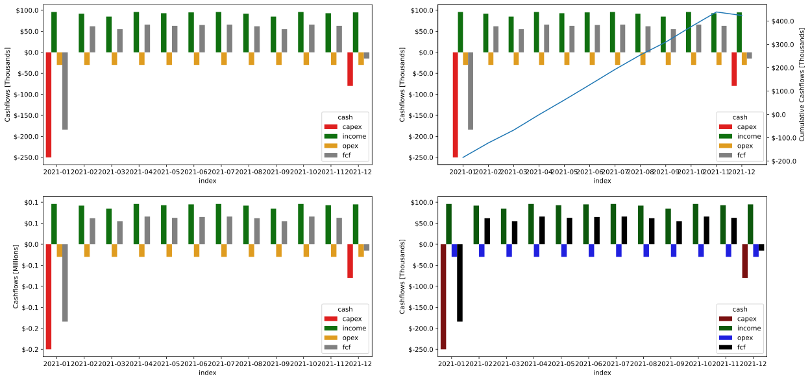
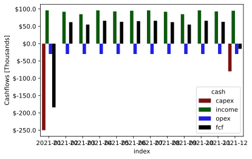

# CashFlow Analysis

Before talking the scheule capabilities, it is required to introduce the user with the CashFlow module. This Module allows you to create a series of cashflow woth the purpose of creating a CashFlow Model which can be used to analized the financial behavior of any forecast produced by `dcapy.dca` Module

This module is inspired by [Python cashflows Package](https://github.com/jdvelasq/cashflows)


```python
from datetime import date 
from dcapy.cashflow import CashFlow
import numpy as np
import matplotlib.pyplot as plt
```


```python
cash1 = CashFlow(
    name = 'Cashflow_zeros',
    start = date(2021,1,1),
    end = date(2021,6,1),
    freq_input = 'M'
)
print(cash1)
print(cash1.get_cashflow())
```

    name='Cashflow_zeros' const_value=0 start=datetime.date(2021, 1, 1) end=datetime.date(2021, 6, 1) periods=None freq_output=None freq_input='M' chgpts=None
    2021-01    0.0
    2021-02    0.0
    2021-03    0.0
    2021-04    0.0
    2021-05    0.0
    2021-06    0.0
    Freq: M, dtype: float64


By default, if the cashflow has no value assignment, it creates an array of zeros. 


```python
cash2 = CashFlow(
    name = 'Cashflow_cons_value',
    const_value= 2000,
    start = date(2021,1,1),
    end = date(2021,6,1),
    freq_input = 'M'
)
print(cash2)
print(cash2.get_cashflow())
```

    name='Cashflow_cons_value' const_value=2000.0 start=datetime.date(2021, 1, 1) end=datetime.date(2021, 6, 1) periods=None freq_output=None freq_input='M' chgpts=None
    2021-01    2000.0
    2021-02    2000.0
    2021-03    2000.0
    2021-04    2000.0
    2021-05    2000.0
    2021-06    2000.0
    Freq: M, dtype: float64


```python
cash3 = CashFlow(
    name = 'Cashflow_different_values',
    const_value= [2000,1500,1252,1458,5869,550],
    start = date(2021,1,1),
    end = date(2026,1,1),
    freq_input = 'A'
)
print(cash3)
print(cash3.get_cashflow())
```

    name='Cashflow_different_values' const_value=[2000.0, 1500.0, 1252.0, 1458.0, 5869.0, 550.0] start=datetime.date(2021, 1, 1) end=datetime.date(2026, 1, 1) periods=None freq_output=None freq_input='A' chgpts=None
    2021    2000.0
    2022    1500.0
    2023    1252.0
    2024    1458.0
    2025    5869.0
    2026     550.0
    Freq: A-DEC, dtype: float64


## Get output cashflow on different time frequency


```python
cash3 = CashFlow(
    name = 'Cashflow_different_values',
    const_value= 100,
    start = date(2021,1,1),
    end = date(2022,12,1),
    freq_input = 'M'
)
print(cash3)
print(cash3.get_cashflow())
```

    name='Cashflow_different_values' const_value=100.0 start=datetime.date(2021, 1, 1) end=datetime.date(2022, 12, 1) periods=None freq_output=None freq_input='M' chgpts=None
    2021-01    100.0
    2021-02    100.0
    2021-03    100.0
    2021-04    100.0
    2021-05    100.0
    2021-06    100.0
    2021-07    100.0
    2021-08    100.0
    2021-09    100.0
    2021-10    100.0
    2021-11    100.0
    2021-12    100.0
    2022-01    100.0
    2022-02    100.0
    2022-03    100.0
    2022-04    100.0
    2022-05    100.0
    2022-06    100.0
    2022-07    100.0
    2022-08    100.0
    2022-09    100.0
    2022-10    100.0
    2022-11    100.0
    2022-12    100.0
    Freq: M, dtype: float64


```python
print(cash3.get_cashflow(freq_output='A'))
```

    2021    1200.0
    2022    1200.0
    Freq: A-DEC, dtype: float64


## Define Number of periods of the cashflow


```python
cash4 = CashFlow(
    name = 'Cashflow_different_values',
    const_value= 10000,
    periods = 6,
    start = date(2021,1,1),
    end = date(2022,12,1),
    freq_input = 'M'
)
print(cash4)
print(cash4.get_cashflow())
```

    name='Cashflow_different_values' const_value=10000.0 start=datetime.date(2021, 1, 1) end=datetime.date(2022, 12, 1) periods=6 freq_output=None freq_input='M' chgpts=None
    2021-01    10000.0
    2021-02    10000.0
    2021-03    10000.0
    2021-04    10000.0
    2021-05    10000.0
    2021-06    10000.0
    Freq: M, dtype: float64


```python
### Set to the last period
```


```python
cash5 = CashFlow(
    name = 'Cashflow_different_values',
    const_value= -10000,
    periods = -1,
    start = date(2021,1,1),
    end = date(2022,12,1),
    freq_input = 'M'
)
print(cash5)
print(cash5.get_cashflow())
```

    name='Cashflow_different_values' const_value=-10000.0 start=datetime.date(2021, 1, 1) end=datetime.date(2022, 12, 1) periods=-1 freq_output=None freq_input='M' chgpts=None
    2022-12   -10000.0
    Freq: M, dtype: float64


### Set custom cashflow throgh time

by setting the `chgpts` parameter as a dictionary with date and value keys, you can make a custom cashflow to certain dates


```python
cash6 = CashFlow(
    name = 'Cashflow_different_values',
    start = date(2021,1,1),
    end = date(2021,12,1),
    freq_input = 'M',
    chgpts = {
        'date': ['2021-03-01','2021-07-01', '2021-12-01'],
        'value': [-500,-600,-700]
    }
)
print(cash6)
print(cash6.get_cashflow())
```

    name='Cashflow_different_values' const_value=0 start=datetime.date(2021, 1, 1) end=datetime.date(2021, 12, 1) periods=None freq_output=None freq_input='M' chgpts=ChgPts(date=[datetime.date(2021, 3, 1), datetime.date(2021, 7, 1), datetime.date(2021, 12, 1)], value=[-500.0, -600.0, -700.0])
    2021-01      0.0
    2021-02      0.0
    2021-03   -500.0
    2021-04      0.0
    2021-05      0.0
    2021-06      0.0
    2021-07   -600.0
    2021-08      0.0
    2021-09      0.0
    2021-10      0.0
    2021-11      0.0
    2021-12   -700.0
    Freq: M, dtype: float64


# CashFlow Models

The `CashFlow` class is very useful when combined in a full CashFlow Model to incorporate income, opex and capex and evaluate the capital efficiency on a Free Cash Flow.

Let's create some cashflows that represent those items.


```python
oil_sell = CashFlow(
    name = 'oil_sell',
    const_value= [60000,58000,55000,62000,65000,64000,60000,58000,55000,62000,65000,64000],
    start = date(2021,1,1),
    end = date(2021,12,1),
    freq_input = 'M'
)

gas_sell = CashFlow(
    name = 'gas_sell',
    const_value= [36000,34000,30000,34000,28000,31000,36000,34000,30000,34000,28000,31000],
    start = date(2021,1,1),
    end = date(2021,12,1),
    freq_input = 'M'
)

gas_sell = CashFlow(
    name = 'gas_sell',
    const_value= [36000,34000,30000,34000,28000,31000,36000,34000,30000,34000,28000,31000],
    start = date(2021,1,1),
    end = date(2021,12,1),
    freq_input = 'M'
)

opex = CashFlow(
    name = 'cost',
    const_value= -30000,
    start = date(2021,1,1),
    end = date(2021,12,1),
    freq_input = 'M'
)

capex_init = CashFlow(
    name = 'capex_initial',
    const_value= -250000,
    periods = 1,
    start = date(2021,1,1),
    end = date(2021,12,1),
    freq_input = 'M'
)

capex_final = CashFlow(
    name = 'capex_initial',
    const_value= -80000,
    periods = -1,
    start = date(2021,1,1),
    end = date(2021,12,1),
    freq_input = 'M'
)


```

## Create a CashFlow Model 


```python
from dcapy.cashflow import CashFlowModel
```


```python
cm = CashFlowModel(
    name = 'Example Cashflow Model',
    income=[oil_sell, gas_sell],
    opex=[opex],
    capex=[capex_init,capex_final]
)

print(cm)
```

    name='Example Cashflow Model' income=[CashFlow(name='oil_sell', const_value=[60000.0, 58000.0, 55000.0, 62000.0, 65000.0, 64000.0, 60000.0, 58000.0, 55000.0, 62000.0, 65000.0, 64000.0], start=datetime.date(2021, 1, 1), end=datetime.date(2021, 12, 1), periods=None, freq_output=None, freq_input='M', chgpts=None), CashFlow(name='gas_sell', const_value=[36000.0, 34000.0, 30000.0, 34000.0, 28000.0, 31000.0, 36000.0, 34000.0, 30000.0, 34000.0, 28000.0, 31000.0], start=datetime.date(2021, 1, 1), end=datetime.date(2021, 12, 1), periods=None, freq_output=None, freq_input='M', chgpts=None)] opex=[CashFlow(name='cost', const_value=-30000.0, start=datetime.date(2021, 1, 1), end=datetime.date(2021, 12, 1), periods=None, freq_output=None, freq_input='M', chgpts=None)] capex=[CashFlow(name='capex_initial', const_value=-250000.0, start=datetime.date(2021, 1, 1), end=datetime.date(2021, 12, 1), periods=1, freq_output=None, freq_input='M', chgpts=None), CashFlow(name='capex_initial', const_value=-80000.0, start=datetime.date(2021, 1, 1), end=datetime.date(2021, 12, 1), periods=-1, freq_output=None, freq_input='M', chgpts=None)]


Create the Free Cash Flow


```python
print(cm.fcf())
```

             oil_sell  gas_sell  total_income     cost  total_opex  capex_initial  \
    2021-01   60000.0   36000.0       96000.0 -30000.0    -30000.0      -250000.0   
    2021-02   58000.0   34000.0       92000.0 -30000.0    -30000.0            0.0   
    2021-03   55000.0   30000.0       85000.0 -30000.0    -30000.0            0.0   
    2021-04   62000.0   34000.0       96000.0 -30000.0    -30000.0            0.0   
    2021-05   65000.0   28000.0       93000.0 -30000.0    -30000.0            0.0   
    2021-06   64000.0   31000.0       95000.0 -30000.0    -30000.0            0.0   
    2021-07   60000.0   36000.0       96000.0 -30000.0    -30000.0            0.0   
    2021-08   58000.0   34000.0       92000.0 -30000.0    -30000.0            0.0   
    2021-09   55000.0   30000.0       85000.0 -30000.0    -30000.0            0.0   
    2021-10   62000.0   34000.0       96000.0 -30000.0    -30000.0            0.0   
    2021-11   65000.0   28000.0       93000.0 -30000.0    -30000.0            0.0   
    2021-12   64000.0   31000.0       95000.0 -30000.0    -30000.0            0.0   
    
             capex_initial  total_capex       fcf   cum_fcf  
    2021-01            0.0    -250000.0 -184000.0 -184000.0  
    2021-02            0.0          0.0   62000.0 -122000.0  
    2021-03            0.0          0.0   55000.0  -67000.0  
    2021-04            0.0          0.0   66000.0   -1000.0  
    2021-05            0.0          0.0   63000.0   62000.0  
    2021-06            0.0          0.0   65000.0  127000.0  
    2021-07            0.0          0.0   66000.0  193000.0  
    2021-08            0.0          0.0   62000.0  255000.0  
    2021-09            0.0          0.0   55000.0  310000.0  
    2021-10            0.0          0.0   66000.0  376000.0  
    2021-11            0.0          0.0   63000.0  439000.0  
    2021-12       -80000.0     -80000.0  -15000.0  424000.0  


## Estimate The IRR and NPV


```python
irr = cm.irr()

print(f'IRR {round(irr,2)}')
```

    IRR 0.31


Define annual rates of 0, 5, 10 and 15%. Convert them to montly basis and call the `nvp method`


```python
annual_rates = np.array([0,0.5,0.1,0.15])
monthly_rates = np.power(1 + annual_rates,(1/12)) - 1
print(monthly_rates)
```

    [0.         0.03436608 0.00797414 0.01171492]


```python
cashflow_npv = cm.npv(monthly_rates)

print(cashflow_npv)
```

                        npv
    0.000000  424000.000000
    0.034366  325004.808220
    0.007974  398668.970497
    0.011715  387312.164217


## Plot The cashflow


```python
fig, ax = plt.subplots(2,2,figsize=(20,10))

cm.plot(ax=ax[0,0])
cm.plot(ax=ax[0,1], cum=True)
cm.plot(ax=ax[1,0], format='m')
cm.plot(ax=ax[1,1], bar_kw={'palette': {
            'income':'darkgreen',
            'opex':'blue',
            'capex':'darkred',
            'fcf':'black'
        }})
```

    /home/scuervo/Documents/dev/apps/dcapy/dcapy/cashflow/cashflow.py:344: UserWarning: FixedFormatter should only be used together with FixedLocator
      grax.set_yticklabels([fmt.format(i/format_dict[format]['factor']) for i in ticks])
    /home/scuervo/Documents/dev/apps/dcapy/dcapy/cashflow/cashflow.py:344: UserWarning: FixedFormatter should only be used together with FixedLocator
      grax.set_yticklabels([fmt.format(i/format_dict[format]['factor']) for i in ticks])
    /home/scuervo/Documents/dev/apps/dcapy/dcapy/cashflow/cashflow.py:352: UserWarning: FixedFormatter should only be used together with FixedLocator
      spax.set_yticklabels([fmt.format(i/format_dict[format]['factor']) for i in ticks_cum])
    /home/scuervo/Documents/dev/apps/dcapy/dcapy/cashflow/cashflow.py:344: UserWarning: FixedFormatter should only be used together with FixedLocator
      grax.set_yticklabels([fmt.format(i/format_dict[format]['factor']) for i in ticks])
    /home/scuervo/Documents/dev/apps/dcapy/dcapy/cashflow/cashflow.py:344: UserWarning: FixedFormatter should only be used together with FixedLocator
      grax.set_yticklabels([fmt.format(i/format_dict[format]['factor']) for i in ticks])


    

    


```python
cm.plot(
    bar_kw={
        'palette': {
            'income':'darkgreen',
            'opex':'blue',
            'capex':'darkred',
            'fcf':'black'
        }
    }
)
```

    /home/scuervo/Documents/dev/apps/dcapy/dcapy/cashflow/cashflow.py:344: UserWarning: FixedFormatter should only be used together with FixedLocator
      grax.set_yticklabels([fmt.format(i/format_dict[format]['factor']) for i in ticks])


    

    


```python

```
