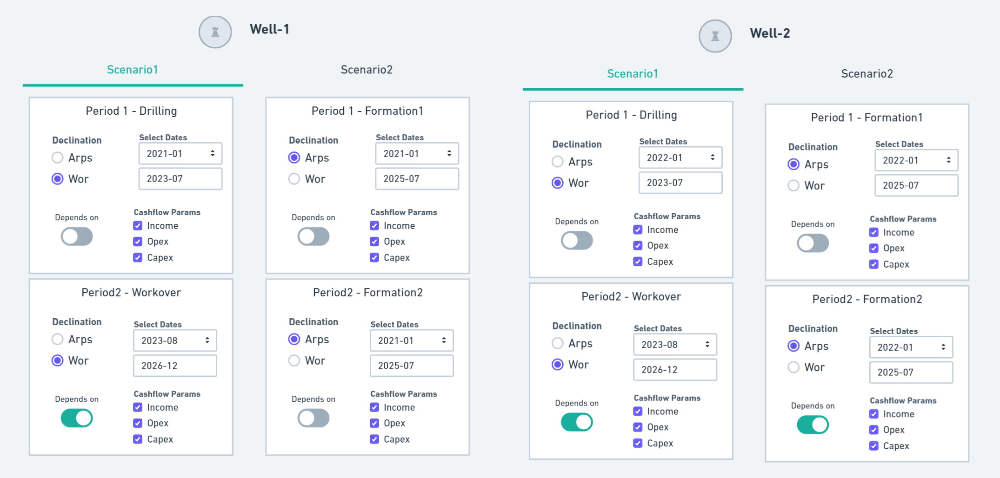

# Forecast Scheduling

So far, the proposed workflows to make production forecast either Arps or Wor methodologies are enough to evaluate a single well forecast even some  probabilistic output. However, when proposing a Field Development Plan based on DCA forecast it is required to put on time those models and observe how they interact with each other, how much oil the wells acumulate and mainly how much value they represent. 

The module `dcapy.schedule` aims to provide the classes to make more robust analysis when evaluation not only one but multiple wells and scenarios. 

The proposed scheme is based on how you can group all the forecast models to get the most relaible and useful model. The next diagram schematically shows how the module is designed.

The diagram shows a `WellsGroup` of two `Wells` in which different `Scenarios` can be defined through the join of multiple `Periods`. 

The main class defined here is the `Period` instance which is a wrapper with no more than a `dcapy.dca.Arps` or `dcapy.dca.Wor` instance with some forecast parameters that defines the output time series. 

+ **Periods**: Class to define the Forecast Model `Arps` or `Wor` with the ranges of dates, limits conditions (economic limit), dependencies and cashflow parameters.

+ **Scenario**: Class to define one or multiple `periods` (Multiple Dca model Models) which can represent the production forecast of different formations or units whose characteristics leads to declare them on separate models. Another scenario in which you can use this class is in the case you have to schedule sequential workovers, so you would get different profiles through time due to these interventions.

In the last case, you can define some conditions to trigger the activation of the next periods like reaching the economic limit rate, reaching a certain amount of cumulative production or just defining on fix start-end dates.

+ **Well**: Class to define a group of `scenarios` of a single well. You could have different alternatives to evaluate so you could change those decision variables across the `scenarios`. 

!!! note
    Note: As seen before, when defining either `dcapy.dca.Arps` or `dcapy.dca.Wor` you can model uncertainty variables through Monte-Carlo sampling. You can still used those variables when defining Periods or Scenarios, so it is suggested to use the different scenarios to evaluate the Decision variables.

+ **WellsGroup**: Instance to define a group of `wells`. When having multiple scenarios on the wells, you can define an experimental design to sample all possible combinatories of the wells scenarios.

In the case of the above diagram you could, for example, evaluate the next production scenarios combinations:

    *Well-1/Scenario-1 & Well-2/Scenario1*
    *Well-1/Scenario-2 & Well-2/Scenario1*
    *Well-1/Scenario-1 & Well-2/Scenario2*
    *Well-1/Scenario-2 & Well-2/Scenario2*