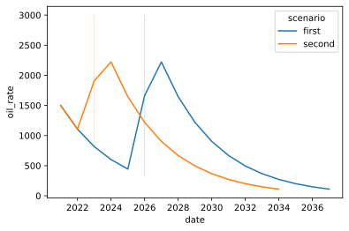
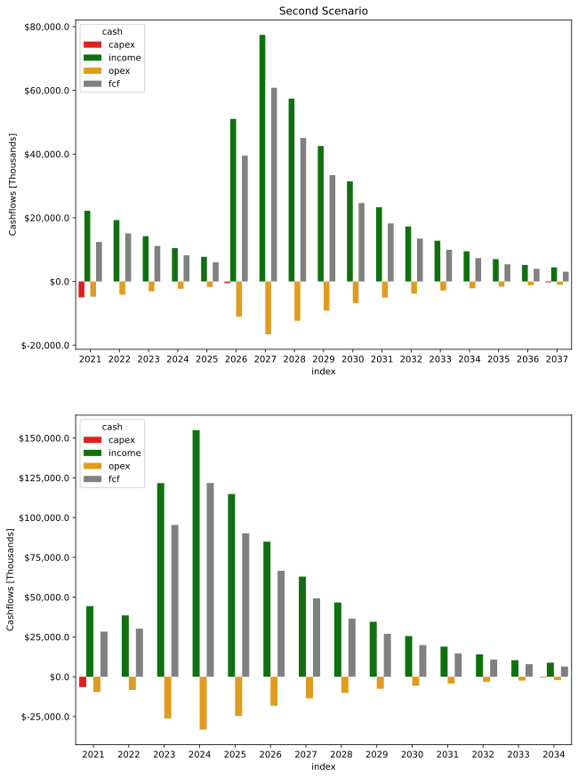

# Forecast Scheduling - Wells and WellsGroup Classes

To take advantage of the scheduling capabilities of covering Wells, Scenarios and peroduction periods, two additional classes must be introduced. Like `Scenario` class they are simple wrappers that allows to group multiple scenarios instances on a `Well` instances and multiple `Wells` into a `WellsGroup` Instance. 


```python
import os

from dcapy import dca
from dcapy.schedule import Scenario, Period, Well, WellsGroup
from dcapy.cashflow import CashFlowParams

import numpy as np 
import pandas as pd
from datetime import date, timedelta
import matplotlib.pyplot as plt
import seaborn as sns 
from scipy import stats
import seaborn as sns
```

Create two scenarios by changing simple parameters that can be denominated as decision variables


```python
#First Period First Scenario

p1a_dict = {
    'name':'pdp',
    'dca': {
        'ti':'2021-01-01',
        'di':0.025,
        'freq_di':'M',
        'qi':1500,
        'b':0,
    },
    'start':'2021-01-01',
    'end':'2040-01-01',
    'freq_output':'A',
    'rate_limit': 300,
    'cashflow_params':[
        {
            'name':'capex',
            'value':{
                'date':['2021-01-01'],
                'value':[-5000000]
                },
            'target':'capex'
        }
    ]
}

#Second Period First Scenario

p2a_dict = {
    'name':'pud',
    'dca': {
        'ti':'2022-01-01',
        'di':0.3,
        'freq_di':'A',
        'qi':3000,
        'b':0,
    },
    'start':'2022-01-01',
    'end':'2040-01-01',
    'freq_output':'A',
    'rate_limit': 100,
    'depends':{'period':'pdp'},
    'cashflow_params':[
        {
            'name':'wo',
            'value':-500000,
            'periods':1,
            'target':'capex'
        },
        {
            'name':'abandon',
            'value':-300000,
            'periods':-1,
            'target':'capex'
        },
    ]
}
s1_dict = {
    'name':'first',
    'periods':[
        p1a_dict,
        p2a_dict
    ],
}
s1 = Scenario(**s1_dict)
```


```python
#First Period Second Scenario

p1b_dict = {
    'name':'pdp',
    'dca': {
        'ti':'2021-01-01',
        'di':0.025,
        'freq_di':'M',
        'qi':1500,
        'b':0,
    },
    'start':'2021-01-01',
    'end':'2040-01-01',
    'freq_output':'A',
    'rate_limit': 700,
    'cashflow_params':[
        {
            'name':'capex',
            'value':{
                'date':['2021-01-01'],
                'value':[-6500000]
                },
            'target':'capex'
        }
    ]
}

#Second Period Second Escenario

p2b_dict = {
    'name':'pud',
    'dca': {
        'ti':'2022-01-01',
        'di':0.3,
        'freq_di':'A',
        'qi':3000,
        'b':0,
    },
    'start':'2022-01-01',
    'end':'2040-01-01',
    'freq_output':'A',
    'rate_limit': 100,
    'depends':{'period':'pdp'},
    'cashflow_params':[
        {
            'name':'wo',
            'value':-50000,
            'periods':1,
            'target':'capex'
        },
        {
            'name':'abandon',
            'value':-300000,
            'periods':-1,
            'target':'capex'
        },
    ]
}

s2_dict = {
    'name':'second',
    'periods':[
        p1b_dict,
        p2b_dict
    ],
}
s2 = Scenario(**s2_dict)
```

There have been created two scenarios with more than one period where the dependency option have been set. 

There are capex and rate limit differences between the scenarios.

As seen, there are different ways of creating the instances due to the versatility that Pydantic gives to not only to create but validate them. In this case, the cashflow parameters that applies for all the scenarios can be set once when creating the `Well` instance and passing a list `CashflowParams` directly.


```python
well_1 = Well(
    name = 'well_1',
    scenarios = [s1,s2],
    cashflow_params = [
        CashFlowParams(
            name = 'fix_opex',
            value = -5000,   # 5 KUSD per well per month
            freq_value = 'M',
            target = 'opex',
        ),
        CashFlowParams(
            name = 'var_opex',
            value = -10,     # 10 USD per barrel of oil
            multiply = 'oil_volume',
            target = 'opex',
        ),
        CashFlowParams(
            name = 'Sells',
            value = 50,     # 50 USD per barrel of oil
            multiply = 'oil_volume',
            target = 'income',
            wi = 0.94,
        )
    ]
)

print(type(well_1))
```

    <class 'dcapy.schedule.schedule.Well'>


Generate Forecast and plot it!


```python
well1_forecast = well_1.generate_forecast(freq_output='A')

#Plot results by scenario
sns.lineplot(data=well1_forecast, x=well1_forecast.index.to_timestamp(), y='oil_rate', hue='scenario')
```

    /home/scuervo/Documents/dev/apps/dcapy/dcapy/dca/arps.py:240: RuntimeWarning: invalid value encountered in true_divide
      (np.power(qi / rate, b) - 1)/(b * di)
    /home/scuervo/Documents/dev/apps/dcapy/dcapy/dca/arps.py:63: RuntimeWarning: divide by zero encountered in true_divide
      return qi/np.power(1+b*di*time_array,1/b)
    /home/scuervo/Documents/dev/apps/dcapy/dcapy/dca/arps.py:80: RuntimeWarning: divide by zero encountered in true_divide
      g = np.power(b*di*time_array+1,(b-1)/b)
    /home/scuervo/Documents/dev/apps/dcapy/dcapy/dca/arps.py:81: RuntimeWarning: divide by zero encountered in true_divide
      h = np.power(b*di*ti+1,(b-1)/b)
    /home/scuervo/Documents/dev/apps/dcapy/dcapy/dca/arps.py:240: RuntimeWarning: invalid value encountered in true_divide
      (np.power(qi / rate, b) - 1)/(b * di)
    /home/scuervo/Documents/dev/apps/dcapy/dcapy/dca/arps.py:63: RuntimeWarning: divide by zero encountered in true_divide
      return qi/np.power(1+b*di*time_array,1/b)
    /home/scuervo/Documents/dev/apps/dcapy/dcapy/dca/arps.py:80: RuntimeWarning: divide by zero encountered in true_divide
      g = np.power(b*di*time_array+1,(b-1)/b)
    /home/scuervo/Documents/dev/apps/dcapy/dcapy/dca/arps.py:81: RuntimeWarning: divide by zero encountered in true_divide
      h = np.power(b*di*ti+1,(b-1)/b)
    /home/scuervo/Documents/dev/apps/dcapy/dcapy/dca/arps.py:240: RuntimeWarning: invalid value encountered in true_divide
      (np.power(qi / rate, b) - 1)/(b * di)
    /home/scuervo/Documents/dev/apps/dcapy/dcapy/dca/arps.py:63: RuntimeWarning: divide by zero encountered in true_divide
      return qi/np.power(1+b*di*time_array,1/b)
    /home/scuervo/Documents/dev/apps/dcapy/dcapy/dca/arps.py:80: RuntimeWarning: divide by zero encountered in true_divide
      g = np.power(b*di*time_array+1,(b-1)/b)
    /home/scuervo/Documents/dev/apps/dcapy/dcapy/dca/arps.py:81: RuntimeWarning: divide by zero encountered in true_divide
      h = np.power(b*di*ti+1,(b-1)/b)
    /home/scuervo/Documents/dev/apps/dcapy/dcapy/dca/arps.py:240: RuntimeWarning: invalid value encountered in true_divide
      (np.power(qi / rate, b) - 1)/(b * di)
    /home/scuervo/Documents/dev/apps/dcapy/dcapy/dca/arps.py:63: RuntimeWarning: divide by zero encountered in true_divide
      return qi/np.power(1+b*di*time_array,1/b)
    /home/scuervo/Documents/dev/apps/dcapy/dcapy/dca/arps.py:80: RuntimeWarning: divide by zero encountered in true_divide
      g = np.power(b*di*time_array+1,(b-1)/b)
    /home/scuervo/Documents/dev/apps/dcapy/dcapy/dca/arps.py:81: RuntimeWarning: divide by zero encountered in true_divide
      h = np.power(b*di*ti+1,(b-1)/b)


    <AxesSubplot:xlabel='date', ylabel='oil_rate'>


    

    


Generate Cashflows


```python
well1_cashflow = well_1.generate_cashflow(freq_output='A')
print(len(well1_cashflow))
```

    2


```python
well1_cashflow[0].fcf()
```


<div>
<style scoped>
    .dataframe tbody tr th:only-of-type {
        vertical-align: middle;
    }

    .dataframe tbody tr th {
        vertical-align: top;
    }

    .dataframe thead th {
        text-align: right;
    }
</style>
<table border="1" class="dataframe">
  <thead>
    <tr style="text-align: right;">
      <th></th>
      <th>Sells_well_1-first-pdp</th>
      <th>Sells_well_1-first-pud</th>
      <th>Sells_well_1-first-pud</th>
      <th>total_income</th>
      <th>fix_opex_well_1-first-pdp</th>
      <th>var_opex_well_1-first-pdp</th>
      <th>fix_opex_well_1-first-pud</th>
      <th>var_opex_well_1-first-pud</th>
      <th>fix_opex_well_1-first-pud</th>
      <th>var_opex_well_1-first-pud</th>
      <th>total_opex</th>
      <th>capex_well_1-first-pdp</th>
      <th>wo_well_1-first-pud</th>
      <th>abandon_well_1-first-pud</th>
      <th>total_capex</th>
      <th>fcf</th>
      <th>cum_fcf</th>
    </tr>
  </thead>
  <tbody>
    <tr>
      <th>2021</th>
      <td>2.218737e+07</td>
      <td>0.000000e+00</td>
      <td>0.000000e+00</td>
      <td>2.218737e+07</td>
      <td>-60000.0</td>
      <td>-4.720718e+06</td>
      <td>0.0</td>
      <td>0.000000e+00</td>
      <td>0.0</td>
      <td>0.000000e+00</td>
      <td>-4.780718e+06</td>
      <td>-5000000.0</td>
      <td>0.0</td>
      <td>0.0</td>
      <td>-5000000.0</td>
      <td>1.240666e+07</td>
      <td>1.240666e+07</td>
    </tr>
    <tr>
      <th>2022</th>
      <td>1.927792e+07</td>
      <td>0.000000e+00</td>
      <td>0.000000e+00</td>
      <td>1.927792e+07</td>
      <td>-60000.0</td>
      <td>-4.101685e+06</td>
      <td>0.0</td>
      <td>0.000000e+00</td>
      <td>0.0</td>
      <td>0.000000e+00</td>
      <td>-4.161685e+06</td>
      <td>0.0</td>
      <td>0.0</td>
      <td>0.0</td>
      <td>0.0</td>
      <td>1.511623e+07</td>
      <td>2.752289e+07</td>
    </tr>
    <tr>
      <th>2023</th>
      <td>1.422205e+07</td>
      <td>0.000000e+00</td>
      <td>0.000000e+00</td>
      <td>1.422205e+07</td>
      <td>-60000.0</td>
      <td>-3.025969e+06</td>
      <td>0.0</td>
      <td>0.000000e+00</td>
      <td>0.0</td>
      <td>0.000000e+00</td>
      <td>-3.085969e+06</td>
      <td>0.0</td>
      <td>0.0</td>
      <td>0.0</td>
      <td>0.0</td>
      <td>1.113608e+07</td>
      <td>3.865897e+07</td>
    </tr>
    <tr>
      <th>2024</th>
      <td>1.050258e+07</td>
      <td>0.000000e+00</td>
      <td>0.000000e+00</td>
      <td>1.050258e+07</td>
      <td>-60000.0</td>
      <td>-2.234592e+06</td>
      <td>0.0</td>
      <td>0.000000e+00</td>
      <td>0.0</td>
      <td>0.000000e+00</td>
      <td>-2.294592e+06</td>
      <td>0.0</td>
      <td>0.0</td>
      <td>0.0</td>
      <td>0.0</td>
      <td>8.207992e+06</td>
      <td>4.686697e+07</td>
    </tr>
    <tr>
      <th>2025</th>
      <td>7.748154e+06</td>
      <td>0.000000e+00</td>
      <td>0.000000e+00</td>
      <td>7.748154e+06</td>
      <td>-60000.0</td>
      <td>-1.648543e+06</td>
      <td>0.0</td>
      <td>0.000000e+00</td>
      <td>0.0</td>
      <td>0.000000e+00</td>
      <td>-1.708543e+06</td>
      <td>0.0</td>
      <td>0.0</td>
      <td>0.0</td>
      <td>0.0</td>
      <td>6.039611e+06</td>
      <td>5.290658e+07</td>
    </tr>
    <tr>
      <th>2026</th>
      <td>6.566778e+06</td>
      <td>2.223132e+07</td>
      <td>2.223132e+07</td>
      <td>5.102941e+07</td>
      <td>-60000.0</td>
      <td>-1.397187e+06</td>
      <td>-60000.0</td>
      <td>-4.730067e+06</td>
      <td>-60000.0</td>
      <td>-4.730067e+06</td>
      <td>-1.103732e+07</td>
      <td>0.0</td>
      <td>-500000.0</td>
      <td>0.0</td>
      <td>-500000.0</td>
      <td>3.949209e+07</td>
      <td>9.239867e+07</td>
    </tr>
    <tr>
      <th>2027</th>
      <td>0.000000e+00</td>
      <td>3.870068e+07</td>
      <td>3.870068e+07</td>
      <td>7.740136e+07</td>
      <td>0.0</td>
      <td>0.000000e+00</td>
      <td>-60000.0</td>
      <td>-8.234188e+06</td>
      <td>-60000.0</td>
      <td>-8.234188e+06</td>
      <td>-1.658838e+07</td>
      <td>0.0</td>
      <td>0.0</td>
      <td>0.0</td>
      <td>0.0</td>
      <td>6.081299e+07</td>
      <td>1.532117e+08</td>
    </tr>
    <tr>
      <th>2028</th>
      <td>0.000000e+00</td>
      <td>2.869882e+07</td>
      <td>2.869882e+07</td>
      <td>5.739764e+07</td>
      <td>0.0</td>
      <td>0.000000e+00</td>
      <td>-60000.0</td>
      <td>-6.106132e+06</td>
      <td>-60000.0</td>
      <td>-6.106132e+06</td>
      <td>-1.233226e+07</td>
      <td>0.0</td>
      <td>0.0</td>
      <td>0.0</td>
      <td>0.0</td>
      <td>4.506538e+07</td>
      <td>1.982770e+08</td>
    </tr>
    <tr>
      <th>2029</th>
      <td>0.000000e+00</td>
      <td>2.126061e+07</td>
      <td>2.126061e+07</td>
      <td>4.252122e+07</td>
      <td>0.0</td>
      <td>0.000000e+00</td>
      <td>-60000.0</td>
      <td>-4.523534e+06</td>
      <td>-60000.0</td>
      <td>-4.523534e+06</td>
      <td>-9.167068e+06</td>
      <td>0.0</td>
      <td>0.0</td>
      <td>0.0</td>
      <td>0.0</td>
      <td>3.335415e+07</td>
      <td>2.316312e+08</td>
    </tr>
    <tr>
      <th>2030</th>
      <td>0.000000e+00</td>
      <td>1.572160e+07</td>
      <td>1.572160e+07</td>
      <td>3.144319e+07</td>
      <td>0.0</td>
      <td>0.000000e+00</td>
      <td>-60000.0</td>
      <td>-3.345020e+06</td>
      <td>-60000.0</td>
      <td>-3.345020e+06</td>
      <td>-6.810041e+06</td>
      <td>0.0</td>
      <td>0.0</td>
      <td>0.0</td>
      <td>0.0</td>
      <td>2.463315e+07</td>
      <td>2.562643e+08</td>
    </tr>
    <tr>
      <th>2031</th>
      <td>0.000000e+00</td>
      <td>1.164684e+07</td>
      <td>1.164684e+07</td>
      <td>2.329369e+07</td>
      <td>0.0</td>
      <td>0.000000e+00</td>
      <td>-60000.0</td>
      <td>-2.478052e+06</td>
      <td>-60000.0</td>
      <td>-2.478052e+06</td>
      <td>-5.076104e+06</td>
      <td>0.0</td>
      <td>0.0</td>
      <td>0.0</td>
      <td>0.0</td>
      <td>1.821759e+07</td>
      <td>2.744819e+08</td>
    </tr>
    <tr>
      <th>2032</th>
      <td>0.000000e+00</td>
      <td>8.636817e+06</td>
      <td>8.636817e+06</td>
      <td>1.727363e+07</td>
      <td>0.0</td>
      <td>0.000000e+00</td>
      <td>-60000.0</td>
      <td>-1.837621e+06</td>
      <td>-60000.0</td>
      <td>-1.837621e+06</td>
      <td>-3.795241e+06</td>
      <td>0.0</td>
      <td>0.0</td>
      <td>0.0</td>
      <td>0.0</td>
      <td>1.347839e+07</td>
      <td>2.879603e+08</td>
    </tr>
    <tr>
      <th>2033</th>
      <td>0.000000e+00</td>
      <td>6.398312e+06</td>
      <td>6.398312e+06</td>
      <td>1.279662e+07</td>
      <td>0.0</td>
      <td>0.000000e+00</td>
      <td>-60000.0</td>
      <td>-1.361343e+06</td>
      <td>-60000.0</td>
      <td>-1.361343e+06</td>
      <td>-2.842686e+06</td>
      <td>0.0</td>
      <td>0.0</td>
      <td>0.0</td>
      <td>0.0</td>
      <td>9.953937e+06</td>
      <td>2.979143e+08</td>
    </tr>
    <tr>
      <th>2034</th>
      <td>0.000000e+00</td>
      <td>4.731363e+06</td>
      <td>4.731363e+06</td>
      <td>9.462727e+06</td>
      <td>0.0</td>
      <td>0.000000e+00</td>
      <td>-60000.0</td>
      <td>-1.006673e+06</td>
      <td>-60000.0</td>
      <td>-1.006673e+06</td>
      <td>-2.133346e+06</td>
      <td>0.0</td>
      <td>0.0</td>
      <td>0.0</td>
      <td>0.0</td>
      <td>7.329381e+06</td>
      <td>3.052436e+08</td>
    </tr>
    <tr>
      <th>2035</th>
      <td>0.000000e+00</td>
      <td>3.505080e+06</td>
      <td>3.505080e+06</td>
      <td>7.010160e+06</td>
      <td>0.0</td>
      <td>0.000000e+00</td>
      <td>-60000.0</td>
      <td>-7.457617e+05</td>
      <td>-60000.0</td>
      <td>-7.457617e+05</td>
      <td>-1.611523e+06</td>
      <td>0.0</td>
      <td>0.0</td>
      <td>0.0</td>
      <td>0.0</td>
      <td>5.398637e+06</td>
      <td>3.106423e+08</td>
    </tr>
    <tr>
      <th>2036</th>
      <td>0.000000e+00</td>
      <td>2.599222e+06</td>
      <td>2.599222e+06</td>
      <td>5.198444e+06</td>
      <td>0.0</td>
      <td>0.000000e+00</td>
      <td>-60000.0</td>
      <td>-5.530260e+05</td>
      <td>-60000.0</td>
      <td>-5.530260e+05</td>
      <td>-1.226052e+06</td>
      <td>0.0</td>
      <td>0.0</td>
      <td>0.0</td>
      <td>0.0</td>
      <td>3.972392e+06</td>
      <td>3.146147e+08</td>
    </tr>
    <tr>
      <th>2037</th>
      <td>0.000000e+00</td>
      <td>2.215218e+06</td>
      <td>2.215218e+06</td>
      <td>4.430436e+06</td>
      <td>0.0</td>
      <td>0.000000e+00</td>
      <td>-60000.0</td>
      <td>-4.713230e+05</td>
      <td>-60000.0</td>
      <td>-4.713230e+05</td>
      <td>-1.062646e+06</td>
      <td>0.0</td>
      <td>0.0</td>
      <td>-300000.0</td>
      <td>-300000.0</td>
      <td>3.067790e+06</td>
      <td>3.176825e+08</td>
    </tr>
  </tbody>
</table>
</div>


```python

fig, ax = plt.subplots(2,1, figsize=(10,15))

well1_cashflow[0].plot(ax=ax[0])
well1_cashflow[1].plot(ax=ax[1])

ax[0].set_title('First Scenario')
ax[0].set_title('Second Scenario')
```

    /home/scuervo/Documents/dev/apps/dcapy/dcapy/cashflow/cashflow.py:342: UserWarning: FixedFormatter should only be used together with FixedLocator
      grax.set_yticklabels([fmt.format(i/format_dict[format]['factor']) for i in ticks])
    /home/scuervo/Documents/dev/apps/dcapy/dcapy/cashflow/cashflow.py:342: UserWarning: FixedFormatter should only be used together with FixedLocator
      grax.set_yticklabels([fmt.format(i/format_dict[format]['factor']) for i in ticks])


    Text(0.5, 1.0, 'Second Scenario')


    

    


```python
well_1.npv([0.1], freq_rate='A', freq_cashflow='A')
```


<div>
<style scoped>
    .dataframe tbody tr th:only-of-type {
        vertical-align: middle;
    }

    .dataframe tbody tr th {
        vertical-align: top;
    }

    .dataframe thead th {
        text-align: right;
    }
</style>
<table border="1" class="dataframe">
  <thead>
    <tr style="text-align: right;">
      <th></th>
      <th>npv</th>
      <th>iteration</th>
    </tr>
  </thead>
  <tbody>
    <tr>
      <th>0.1</th>
      <td>1.737080e+08</td>
      <td>0</td>
    </tr>
    <tr>
      <th>0.1</th>
      <td>4.103465e+08</td>
      <td>1</td>
    </tr>
  </tbody>
</table>
</div>


